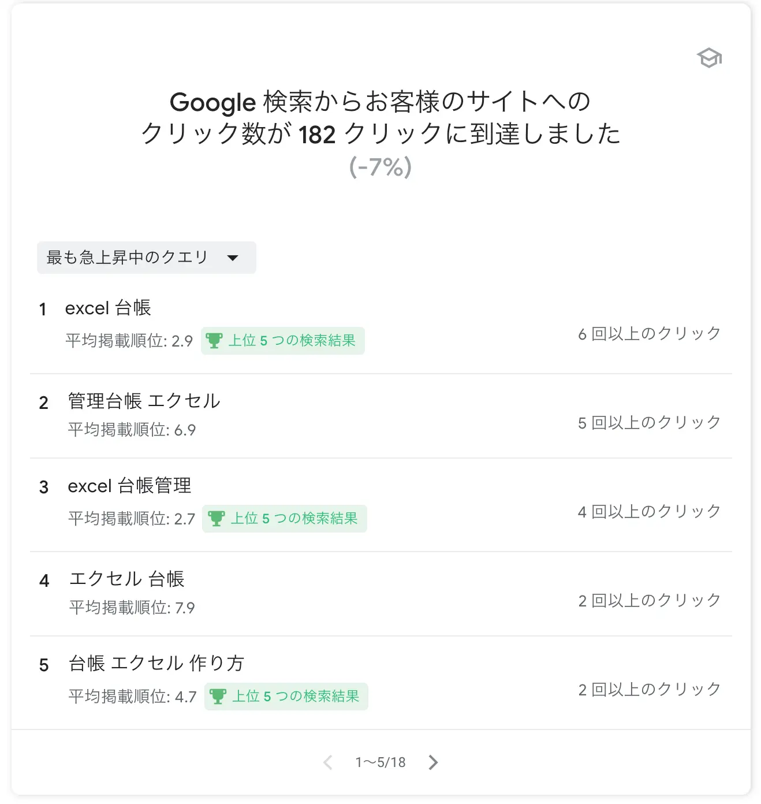
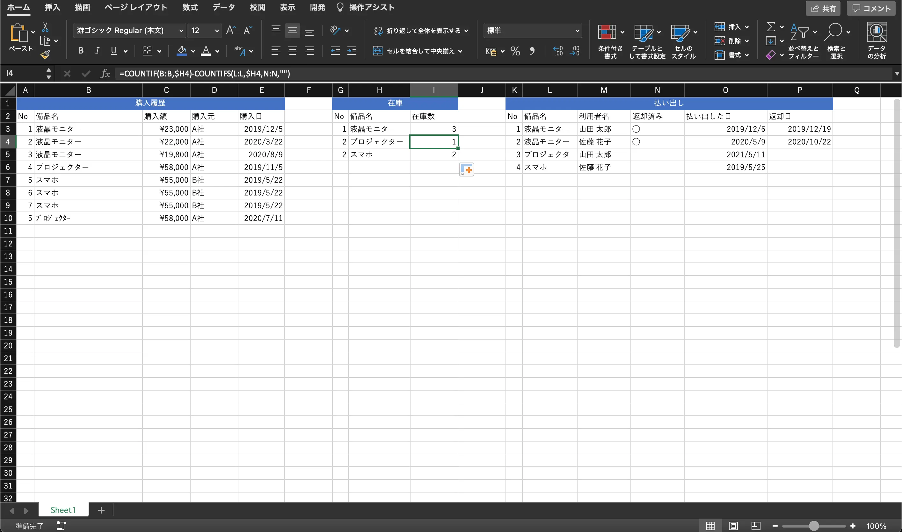
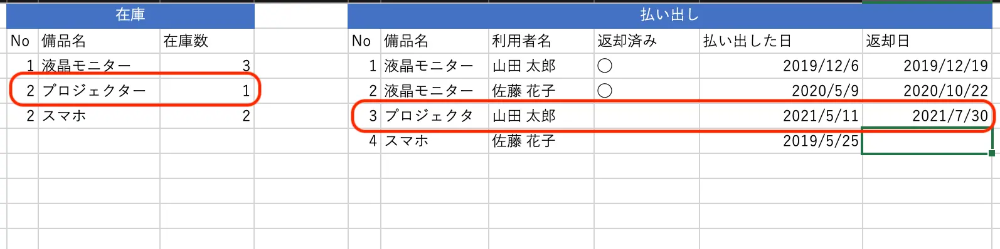

このブログではクラウドや業務改善についての記事をよく書いているのですが、Excel での台帳管理について検索した結果、このブログの記事を見ていただいている方も多いようです。


Excel の使い方、台帳の作り方のコツが分かっているかどうかが、使いやすい台帳のカギになっています。次の課題は Excel の台帳あるあるではないでしょうか。

- 入力間違いが含まれている
- 情報が古い
- 関数が複雑で何をしているかわからない
- 関数が複雑なので、変更や修正、機能追加が簡単にできない

前任者の前任者が作った台帳が今もそのまま使われているために、**秘伝のタレ化**してしまっていて、変えるに変えれないということもよくあると思います。

今回は2回に分けて**台帳を作るコツ**と、作った台帳をより効率的に、そして**テレワークでも使えるようにする**にはどうしたらよいかを書いていきたいと思います。

## 台帳を見直すその前に
秘伝のタレと化した Excel 台帳にいきなり手を入れるのは、当然のことながらなかなかリスクがあります。まずは次のステップでこの Excel 台帳で何を管理しているか、どんな作業をしているかを整理しましょう。

### 台帳で管理している目的を再確認する
前任者の前任者から引き継いだような長年続いている業務の場合、その業務の目的が曖昧だったり、別の仕組みに置き換わっていることがあります。**そもそもなぜこの台帳が必要なのか**、なければ何が困るのかを改めて確認してみましょう。

同じような台帳を作っていたりする場合もあるので、自分が担当している業務以外にも目を向けてみるのも良いと思います。

### 手順を起こす
台帳の目的や必要性を再確認できたら、台帳に関する作業の手順を起こします。

1つの台帳を使った作業は思ったよりも多いはずです。例えば備品管理の台帳を例にとると次のような作業があると思います。

- 備品の購入
- 備品の払い出し
- 備品の返却
- 備品の廃棄
- 棚卸し

それぞれの作業で手順を起こします。作業手順を起こすコツはこちらの記事も参考にしてみてください。

[事務作業を効率化すべき3つの理由と6つのコツ](https://linkup.works/blog/3reasons-why-you-should-streamline-your-paperwork-and-6tips/#%E6%89%8B%E9%A0%86%E6%9B%B8%E3%82%92%E4%BD%9C%E3%82%8B)

コツは、**その手順を行うために必要なもの(インプット)** と、**その手順を実施した結果が何か(アウトプット)** を明確に書くことと、**箇条書きで書く**ことです。
この2つを意識して書くだけで手順全体の見通しがよくなります。

また、次のような例外パターンも漏れなく書いてください。

>文房具をA社から購入するが、コピー用紙だけはB社から購入し、FAXで発注する

台帳の作成そのものには大きく影響はしないかも知れませんが、ここで起こした手順を元に、システム化(第2回で書きます)をする際には重要な情報となります。また、例外だらけの作業だとすると、それをできる限り統一できないかを検討してみるのも良いでしょう。

## 台帳を作るコツ
前置きが長くなりましたが、ここからは、備品管理をしている台帳を例に解説したいと思います。



一つのシートですべての作業が完結できそうで、一見これでもいいように見えますが、次のような課題が見えてきます。

- 長く使い続けると、購入履歴の行だけがどんどん増えて見づらくなる
- 在庫を求める関数が何をやっているのかわかりにくい
  - 購入履歴から備品の文字列をカウントして購入数を算出(COUNTIF(B:B,$H3))
  - そこから、返却日が空欄(未返却状態)の備品の数を引く(-COUNTIFS(L:L,$H3,N:N,"")) 
- 備品の名前が統一されていない
  - 購入履歴の『ﾌﾟﾛｼﾞｪｸﾀー』、払い出しの『プロジェクタ』
- 手入力が多いので入力間違いが起こりそう
  - IDの欄など連番が正しくない
  - 入力項目の統一ができない
- 現在の在庫数が正しくない
  - 関数で求めているが、備品の名前がきちんと統一されていないので、在庫数が正しくない場合がある
  - プロジェクタの在庫は2台で1台貸出中なので台数は合っているが、返却されても1台のまま

台帳を作るコツとしては次の2つを意識してみましょう。

1. 手作業させない
2. 役割を明確にしてシンプルにする

### 手作業させない
備品の名前や利用者名、ID など入力間違いや、表記のゆらぎなどがあると、集計をした際に正しくない結果になる場合があります。

在庫を求める関数を見てみると、購入履歴の中からH4セルの『プロジェクター』を検索条件にして総数をカウントしています。そして、総数から**未返却の台数を引いた数**が現状の在庫数となります。

しかし、B10セルの『ﾌﾟﾛｼﾞｪｸﾀｰ』は検索条件(プロジェクター)に一致しないので、**総数にカウントされません。**

また、払い出したL2セルの『プロジェクタ』も検索条件(プロジェクター)に一致していないため、**未返却かどうかが判定されません。**

そのため、『プロジェクター』の**総数は1台**で**未返却の台数は条件不一致で0**なので、現状の**在庫数は1台**となります。

今は数字上は合っていますが、L2セルの『プロジェクタ』が返却されて(返却日を入力して)も現状の在庫数が増えないので、現状の**在庫数が1台のまま(正しくは2台)** です。



手作業が多い台帳はこうした集計間違いや正しくない情報が紛れ込みやすくなります。台帳に1つでも正しくない情報が紛れ込んでいると、その台帳に登録されている情報が本当に正しいのか疑わしくなります。

結果的に、正しい情報に直す手間が発生したり、間違った情報を元に作業を進めた結果、手戻りや管理している情報によっては取引先に損害を与えることに繋がりかねません。

入力する項目がある程度決まっているようであれば、**入力規則** を使いましょう。



リストの中から入力項目を選べるようにして、リストにない項目は入力できないようにすることができます。これによって、用語を統一することができますし、入力間違いを防止することができます。

しかし、入力規則も選択肢が多すぎると視認性が悪くなり、かえって使いづらくなります。個人的な感覚ですが、10個〜20個くらいまでが限界ではないでしょうか。
>※都道府県を選ぶようなリストの場合は、ある程度並びや選択できる項目がわかっているので例外的と言えます。

その場合は、次の章でも紹介しますが、**役割を明確にしてシンプルにする**ことが重要になりますので、入力規則の項目をより細分化したり、カテゴリ分けできないか検討してみましょう。

また、IDやNoのように、連番をふる場合は、関数を使うことをおすすめします。途中に行を追加しても自動的に連番をふり直してくれますし、番号のふり間違いもなくなります。



```
=row()-x
```

という関数は、行番号(`row()`)からXの数を引いた値を導き出す関数です。そのため、この台帳では3行目(行番号3)から No1 が始まるので、`=row()-2`としています。

連番の先頭や後ろに、何らかの文字列を追加することもできます。その場合は`="文字列"&ROW()-X`や`=ROW()-X&"文字列"`とします。

### 役割を明確にしてシンプルにする
よくありがちなのが、一つのセルや一つのシートで、**多くのことをやりすぎている**ということです。例で作成した備品の管理台帳では、1つのシートで購入履歴、在庫、払い出しの履歴の3つを管理している状態です。

例えば、しばらくこの台帳を運用していると、在庫の管理は、管理している備品の製品が増えない限りは行が増えませんが、購入履歴や払い出しの履歴が長くなる一方です。その結果、台帳が使いづらくなることが予想されます。また、各管理項目で列を追加した時に、関数が崩れたりする場合があります。


また、在庫の数を求める関数も、ひと目では何をしているのか、どんな計算式なのかわかりにくく、修正を加える際にどんな動きをしているのか追いかけながら修正が必要になります。この関数自体はまだ簡単な方ですが、関数が長くなればなるほど修正が難しくなります。


そのため、まずは用途ごとにシートを分けることをおすすめします。

例として、購入履歴と、在庫の管理、払い出しの管理の3つくらいに分けます。それ以外の分け方としては入力用シートと出力用シート、集計用シートといった分け方をする場合もあります。

## まとめ
これらのコツを踏まえて改善した台帳がこちらです。



入力規則や関数などを使って手入力がほとんど必要なくなったので、自動的に在庫数が変動したり、間違いのない入力ができるようになりました。金額や日付の欄も、整数や日付以外は入力できないようにしています。そのため、これらの欄で文字を入力するとエラーとなります。

また、一見わかりにくかった関数も、シートが分かれたことで、どんなことをしているのか比較的わかりやすくなりました。

今回作成した台帳のサンプルは[こちらから](https://drive.google.com/uc?export=download&id=1c8jzIeb-XAtqMTN6jX8O7S08tQ76AvR2)ダウンロードいただけます。