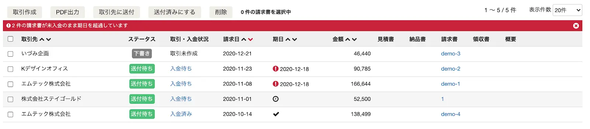
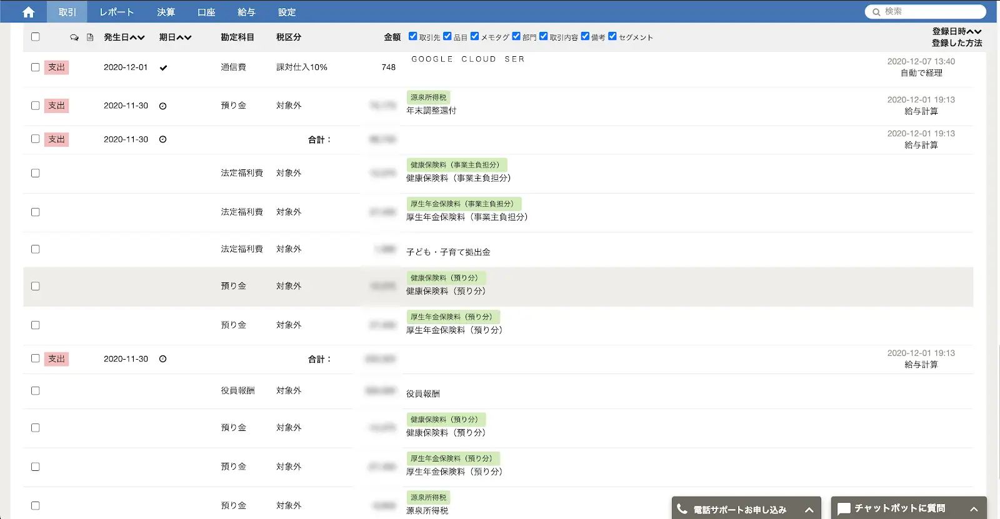
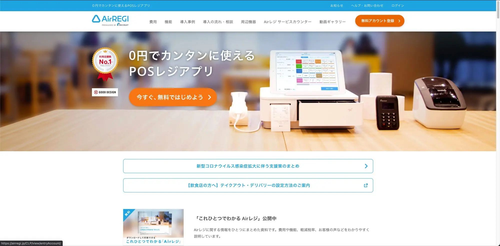
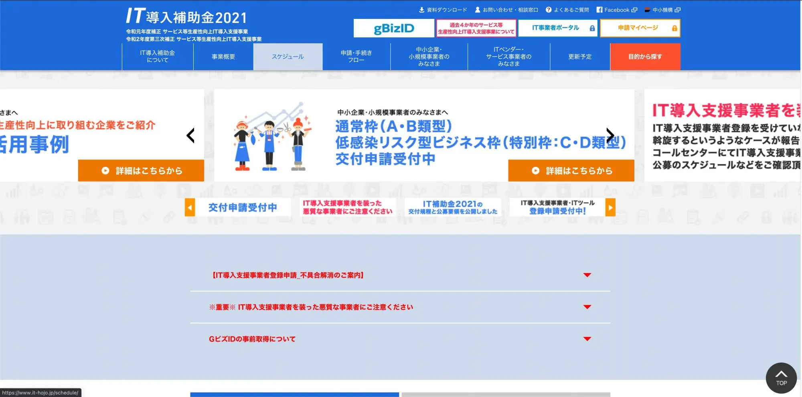
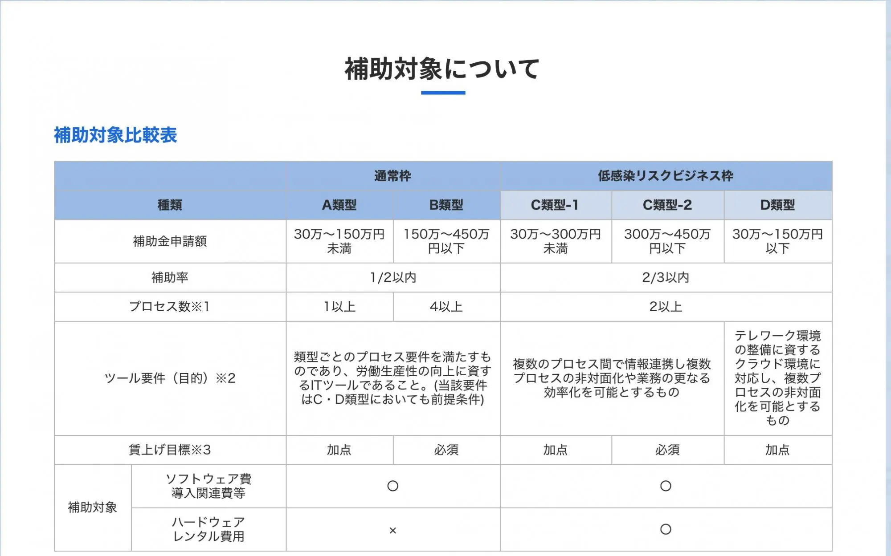
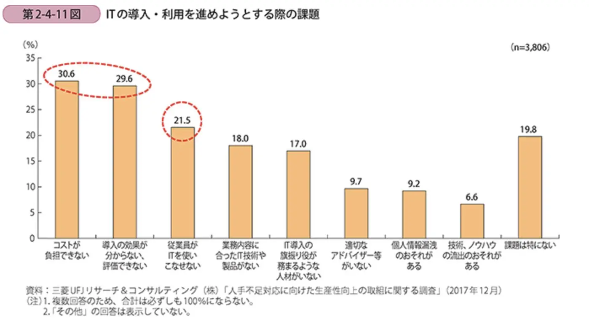

IT の導入で業務を効率化というと、ある程度規模の大きな企業でしか有効ではないように思われるかもしれません。

ある業務を効率化するために、システムを導入して改善しようと考えた場合、改善にかかる初期費用、維持費用、現状かかっているコストよりも高額になると、そのままにしておいたほうがコストメリットがあります。小規模企業では特定業務の量が極端に多い、ということは少ないと思います。そのため、IT を導入しても投資対効果が出ないのでは?と思われる方もいるかも知れません。

しかし、そうした小規模企業であっても IT を導入するメリットは当然あります。今回は小規模企業であっても、IT の導入で投資対効果を出す方法をご紹介します。

## その1　クラウドを活用する
まずは**クラウド**を活用するということです。

クラウドはインターネットを介してソフトウェアやサーバーなどを利用することができるサービスを指します。クラウドを利用することのメリットやどういったサービスがあるかはこちらの記事もご覧ください。

[クラウドを活用するメリットとデメリット]()  
[使うと便利なクラウドのサービスとその特徴]()

クラウド以前はパッケージのシステムが主流でした。CD や DVD を使って特定のパソコンにソフトウェアをインストールして使います。パッケージのデメリットは初期費が高額になるという事と、定期的に買い替えが必要な場合がある、ということです。

システムによって金額は差がありますが数万円〜数十万円するものが多い印象です。その他に、年間数万円の保守費用を払うことでサポートや定期的な更新などを受けるといった事が多いです。また、複数台のパソコンにインストールする場合は、その分ライセンスの購入が必要になることもあります。

作業する従業員が複数いたり、システムのインストールされたパソコンが壊れたり、災害で使えなくなってしまった、といったことがあると業務に大きな影響が出てしまいますので、予め別のパソコンにもインストールする、と言った理由でライセンスの追加購入をするケースがあります。

一方でクラウドは従量課金や1ユーザーから月額定額で利用可能なサービスが主流です。

数百円からスタートできるサービスも多く、インターネットを介してソフトウェアを利用するため常に最新のソフトウェアが提供されています。そのため、インストール作業や定期的なアップデート作業などの手間もありません。ライセンスの追加、削減もすぐにできますし、止めたいときにはいつでも止めることができることも特徴です。

## その2 他のシステムと連携させて相乗効果を出す
一度の投資額は大きくはなってしまいますが、導入したシステムを軸に、他のシステムを連携させることを念頭において、複数の業務の省力化、効率化をする。ということも効果を高めることに繋がります。

### 会計ソフトの例
会計ソフトを使っていない企業はあまり多くはないと思いますが、会計ソフトだけを使っていても次のような業務が多いと思います。

- 入出金額や勘定科目などを手入力する
- 定期的に銀行に記帳しに行って会計ソフトに転記する
- 給与計算して算出された法定福利費や、従業員への振込額を転記する
- POS レジでの入出金を集計して手入力する

会計ソフトを使っているがゆえに止めるわけにもいきませんし、時間もそれなりに掛かる作業です。

クラウド会計ソフトの[freee会計](https://www.freee.co.jp/)などでは、予め給与計算ソフトや POS レジ、銀行口座などと連携する仕組みが備わっているので、上述した作業は殆ど**自動化**することができます。

#### freee会計 と銀行口座の連携
オンラインバンキングが利用できることが前提ですが、freee会計 は銀行口座と連携して、入出金を自動的に取得し、勘定科目を推測して自動で登録(修正もできます)することができます。銀行口座と連携しているだけで、銀行に記帳しに行ったり、入出金の額を転記したりする手間は全く**ゼロ**になります。

また、freee会計 を使って請求書を発行すると、**自動的に売掛金として登録**され、銀行口座に同額の入金があると**自動的に消し込み**までしてくれます。

#### freee会計 と人事給与システムとの連携
freee会計の開発元のfreee株式会社では、給与計算システムの[freee人事労務](https://www.freee.co.jp/hr/)freee人事労務で給与計算して算出された、法定福利費や振込額などの金額は、freee会計に自動で登録することができます。

freee人事労務では給与計算にかかる作業の多く(出退勤の打刻、有給申請など)が自動化できるため、給与計算にかかる作業や会計ソフトに転記する作業、都度のチェックや集計なども大幅に省力化できます。

#### freee会計 とPOSレジとの連携
従来の POS レジでは連携できませんが、iPad などタブレットを活用した POS レジと連携して売上を自動的に登録することができます。

[freee アプリストア POSレジ](https://app.secure.freee.co.jp/applications/search?app_category_id=7)

POS レジで行った入出金の登録だけでなく、POS レジ自体で売上管理、在庫管理、様々な切り口での分析もできるようになっているため、売上を上げるためのヒントを探ったり、機会損失をなくすことができます。

## その3 補助金を利用する
最後にご紹介するのは補助金です。IT 導入に関する費用を、補助金を活用して大幅に削減することができます。

[IT 導入補助金](https://www.it-hojo.jp/)

補助率も通常であれば1/2の補助、コロナによるビジネスモデルの転換による IT 導入であれば 2/3 の補助が認められています。

## まとめ
中小企業庁の統計では、IT の導入に関して課題として以下の3つが多いという結果が出ています。

1. コストが負担できない
2. 導入の効果がわからない、評価できない
3. 従業員が IT を使いこなせない

コストの負担の面では、クラウドや補助金などを活用して安価に抑えることができます。また、導入の効果や IT を従業員が使いこなせないといった点については、商工会などを通じての専門家派遣などが有効です。