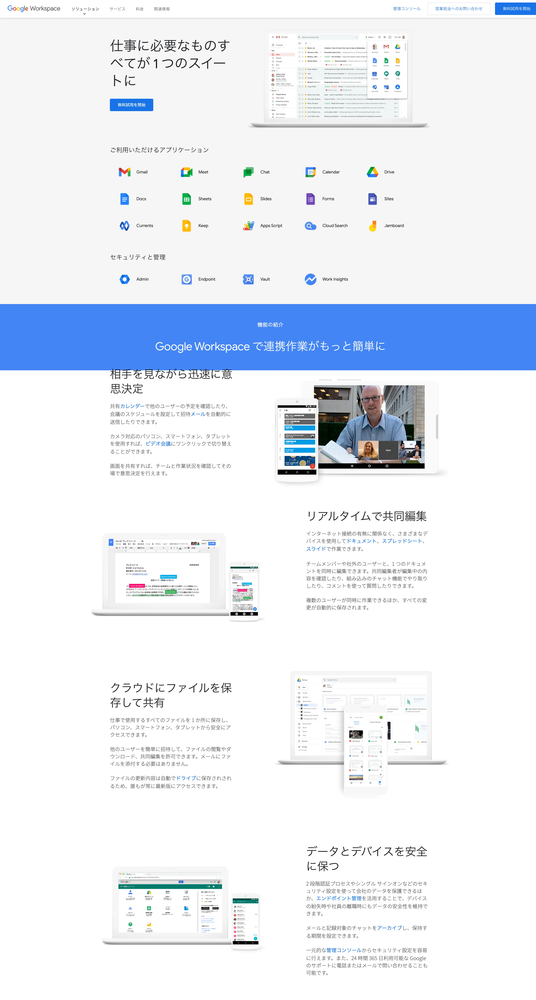

しばらく前から**テレワーク実践ガイド**というものを制作していまして、昨日(2021/7/28)ようやく公開することができました。

[こちらの購入ページ]() にも書いていますが、テレワークをするために予め何を決めておかなければならないか、どんな進め方をしたらよいかなどを盛り込んでいます。

ガイドの中でも紹介していますが、多くの企業では『**テレワークできる仕事はない**』といった考え方も多く、浸透して上手く活用できている企業と、そうでない企業が二極化しているように思います。
今回は『**テレワークできる仕事はない**』という誤解を解くのと合わせて、在宅勤務する以外にどういったメリットがあるのかをご紹介したいと思います。

## 『テレワークできない』は当然のこと
総務省の行った[調査](http://teleworkkakudai.jp/seminar/2020/pdf/iwate/01_soumu201127.pdf)で、中小企業でテレワークができない理由としては『**テレワークできる仕事がない**』というのが最も多い結果となりました。

この調査から『今の仕事のやり方のままでテレワークしたい』という希望が多いように思います。しかし、今の仕事のやり方のままでテレワークすることは、**かなり難しい**と言わざるを得ません。  
理由はシンプルで、そもそも多くの企業では今の仕事のやり方が、**出社して仕事をすることが前提**で仕組み化されているからです。

そのため、テレワークができるように、ある程度今の業務を効率化したり、デジタル化をしておく必要があります。すぐに思い浮かぶところとしては、次のような業務を見直すことをおすすめしています。

- ハンコが必要な業務
- 紙での申請が必要な業務
- FAX や郵送など、その場にいかなければできない業務

こうした業務を見直して、紙での申請を PDF やメールにすることはできないか、ハンコを廃止することはできないか、などをぜひ検討してみてください。

## 効率化するためのおすすめツール
ガイドの中では、[Google Workspace](https://workspace.google.co.jp/intl/ja/) というツールを紹介しています。Google Workspace はビジネス用の Gmail の他に、オンライン会議ツールやクラウド上の保存領域、チャットツールなどがパッケージされている、月額定額で利用可能なツールです。

オンライン会議ツールやチャットツールなど多種多様なツールが多くの企業から提供されていますが、どのツールがいいのか、ツールの中のどのプランがいいのか選ぶことはなかなか大変です。Google Workspace は、各ツールが上手く連携されているので、比較的簡単に効率化が図れますし、トライアンドエラーを素早く回すことができます。

ガイドの中で初期設定手順を画像つきで解説していますので、どんな事ができるか社内で試してみることもおすすめしています。

## 在宅で仕事する以外のメリット
テレワークと言うと、イコール在宅勤務というイメージがあります。しかし、在宅勤務はテレワークの持つ多くのメリットの一つでしかありません。ガイドの中では次の5つのメリットを紹介しています。

1. 業務の効率化
2. 社内外の研修、セミナー、コンサルティング
3. 遠隔地の顧客との商談
4. 遠隔地での採用
5. 離職の防止

この内、『業務の効率化』についてはすでに書いたとおりで、テレワークをするためにはある程度デジタル化を進めて、業務を効率化していなければ実践が難しいです。それが翻って、テレワークをすることで社内のデジタル化、業務の効率化を推し進めることに繋がります。

業務の効率化が進めば、働く場所を選ばなくなります。

それによって在宅での勤務がしやすくなるのですが、その結果『遠隔地での採用』、『離職の防止』という2つが特に大きなメリットとなります。

### 遠隔地での採用
ガイドの中でも紹介していますが、コロナ以降、転職先に求める条件として『**テレワークができるか**』という回答が年収の次に多い、という調査結果もあります。

[転職に重視する条件「リモートワーク」が40％以上／コロナ禍の転職意識調査](https://www.jmsc.co.jp/corporate/recruit/129/)

2020年以降、企業の規模問わず、多くの企業で一気にテレワークが浸透し、それが比較的長期間に及びました。その結果うまくいった、いかないはあるにせよ、SNS や各種メディアを通じて、テレワークのメリットやこれまで当然だった業務のあり方を疑問視する意見が広く拡散されました。

通勤時間がなくなった、家族との時間が増えた、田舎暮らししながら勤務できるといった、働き方やライフスタイルが良い方向に変化したという声や、ハンコを廃止した(行政でも！)、オフィスを引き払ったといったようなこれまでの常識が覆った事例も多くありました。

こうしたメリットが多くの目に留まることで、転職先でもテレワークができることが重要という意見が多いのもうなずけるかと思います。

これまでは会社の所在地で採用をするのが当たり前でしたが、地方の多くでは少子高齢化が進み、採用難が大きな課題となっていました。テレワークできることによって働く場所を選ばなくなれば、社員がどこに住んでいても業務ができるので採用難の解消に繋がります。日本全国、あるいは日本語が通じれば海外在住でも(時差の問題が出てきますが)採用できる可能性が生まれます。

面接をするにしても、オンライン会議ツールでできるのでわざわざ来社して貰う必要がないので、時間も交通費も節約することができます。

### 離職の防止
働く場所を選ばなくなることで得られるもう一つの大きなメリットとして、離職の防止があります。

これまでは介護や育児、配偶者の転勤など様々なライフイベントによって退職を余儀なくされるケースが多くありました。

こういった離職は企業にとっても痛手でしたが、働く場所や時間を選ばない環境ができれば、転勤先でも仕事を続けることができる可能性も生まれます。フルタイムで出勤して仕事をすることは難しいので、『**在宅で時短勤務する**』といった、その人のライフスタイルを最大限尊重しながら柔軟な働き方を実現できる可能性があります。

遠隔地で採用もしつつ、離職も減らすことができれば、人手不足の解消、貴重な人材の流出を防ぐことに繋がります。

## まとめ
[テレワーク実践ガイド]() で紹介している、在宅勤務以外の5つのメリットのうち、2つを詳しく紹介しました。非常に大きなメリットで、採用難、人材不足といった、これまで抱えていた重大な課題を解決できる可能性も秘めています。

『**ウチではテレワークできる仕事はない**』と決めつけずに、是非こうしたメリットを享受するために、どのように業務を変えていけばよいか、どういったことを事前に決めておくべきかなどを、[テレワーク実践ガイド]() で実践していただけたらと思います。