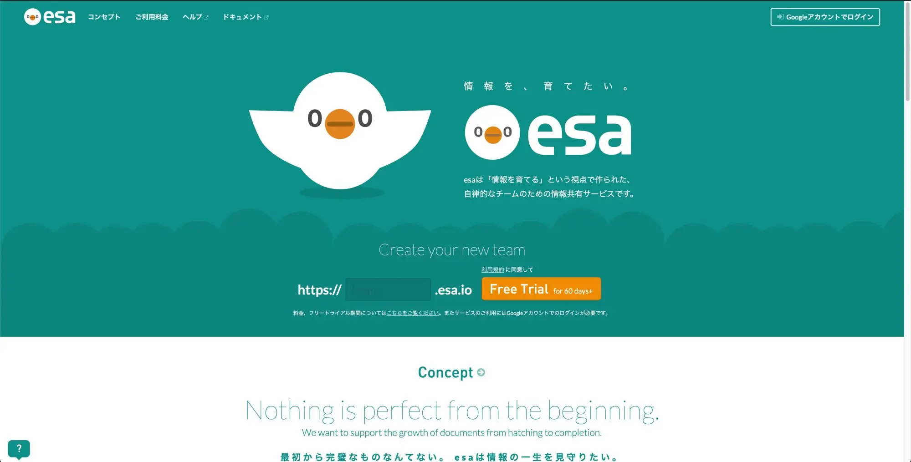
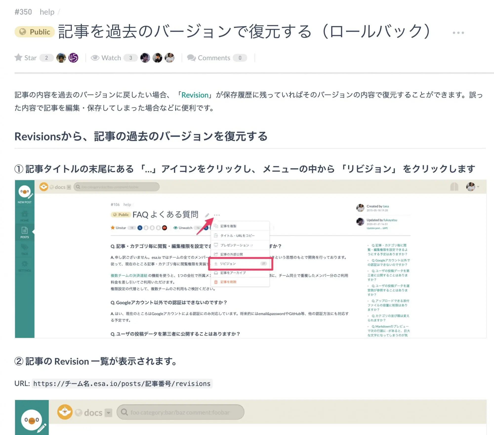
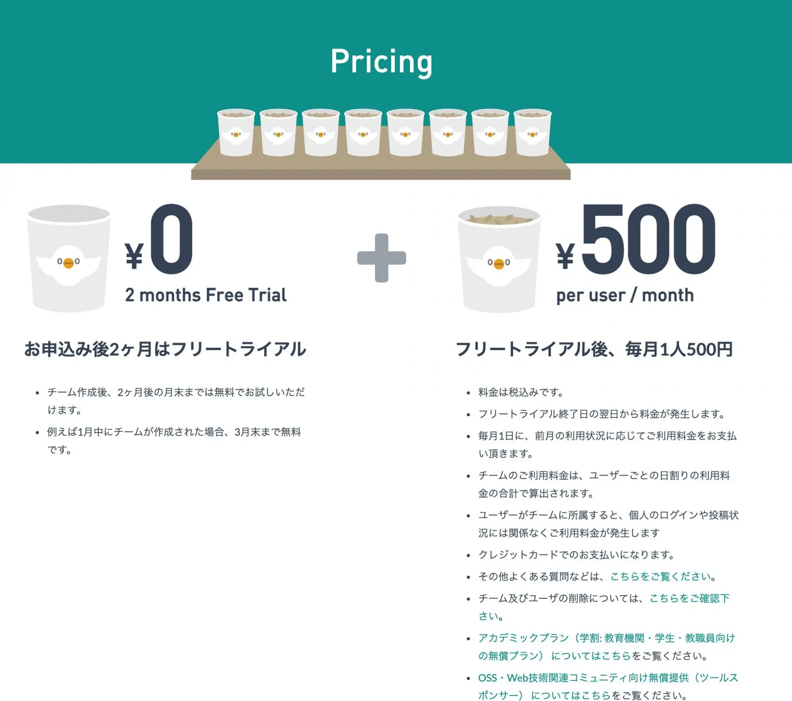
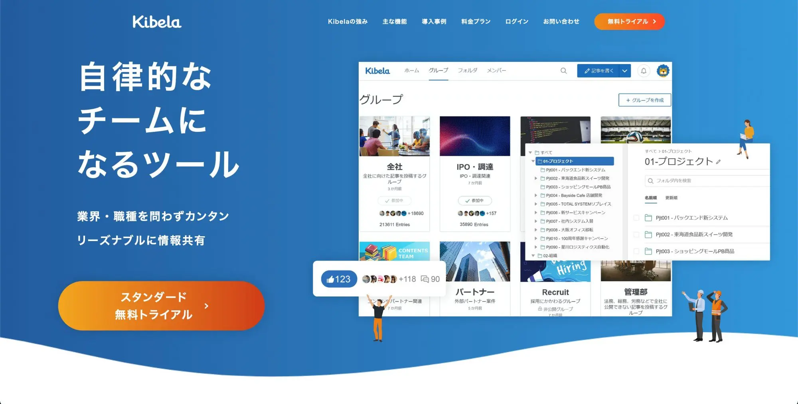
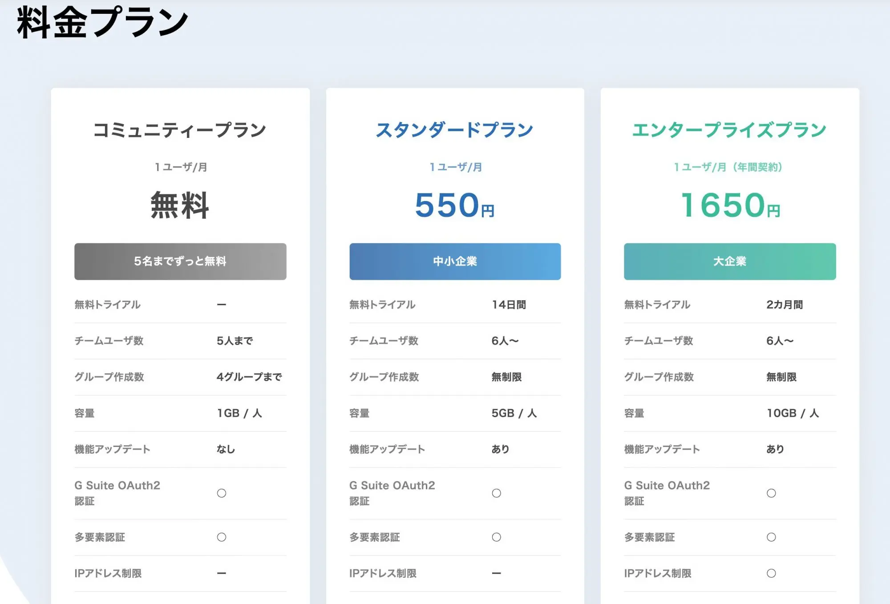

「この業務は〇〇さんしか手順を知らない」、「〇〇についてはXXさんの担当」といったことはどの職場にもあると思います。**属人化**と呼ばれる、特定の仕事やノウハウが特定の人に紐付いた状態(決済を承認すると行った管理職業務は含みません)は多くのデメリットをもたらします。

この記事では属人化が与えるデメリットと、解消するためのステップ、便利なツールについてをご紹介します。

## そもそも属人化とは？
そもそも属人化とは、**ある業務の手順やノウハウが特定の人しか知らない状態**を指します。当人以外ではその業務を行えなかったり、ノウハウやコツを当人しか知らないことでアウトプットの品質にばらつきが出ることになります。

属人化が起こる理由は様々で、人に任せるより自分でやったほうが早いという考えがあったり、引き継ぎたいが引き継ぎ時間も余裕もない、といったように個人の意識や組織風土など多くの要因があります。

## 属人化のデメリット
### 業務がブラックボックス化する
属人化のデメリットの最たるものとしてあげられるのが、業務のブラックボックス化です。具体的な例を上げてみます。

> 例: 取引先への請求業務は事務を担当している A さんしか手順を知らない。

極端な例かもしれませんが、このような会社があった場合、Aさんが急に休んだときなどは請求業務がストップしてしまいます。

簡単な手順などが書き残されていれば、それを元に代理で業務に当たることができますが、業務のスピードも遅くなりますし、仕事としての品質もばらつきが出ます。Aさんが長期的に休みになってしまった場合にはその影響は小さくありません。

また、Aさんが常に請求業務を行っている場合、その業務のやり方が効率的かどうかはAさんの視点でしか判断できません。
つまり、**誰が何をやっているのか第三者から見たときにわからないし、改善が必要かどうかはその人次第**ということになります。

### 成果の品質にばらつきが出る
ある業務が特定の人しかできないわけではありませんでしたが、**人によってやり方が違っていた。** という属人化のパターンです。
同じ業務なのに、Aさんのやり方と、Bさんのやり方が違うと、成果物の品質が一定ではなくなります。そのため、このパターンの属人化を放置したまま、品質向上のために品質チェックの基準を定めたり、チェックの体制をとると非常に効率が悪いです。

## 属人化を解消するためのステップ
属人化を解消するためのステップについて話を進める前に、**暗黙知**と**形式知**という2つのキーワードに触れておきたいと思います。
暗黙知は**言葉や図では表しづらい知識**を指します。例えば、長年に渡ってその業務を通じて培ってきたコツや、当人しか知らないマニュアル化されていない業務の手順やノウハウなどです。

一方、形式知は**言葉や図で表せる知識**を指します。正にマニュアルがそうです。
暗黙知と形式知に触れたところで、以下のステップで属人化を解消します。

1. **暗黙知を形式知に変換する**
2. **標準化して共有する**

### 暗黙知を形式知に変換する
暗黙知を形式知に変換するためにはマニュアルを作成します。最初から体裁を整えたり、細かいところにこだわったものでなくても構いません。最初はパソコンにインストールされているメモ帳や、手書きでノートなどに一連の手順を書き出してみます。

手順を書き出す際にポイントとなるのが次の2点です。
- 特定の状況でしか行わないような例外の作業や、ちょっとしたコツがあれば、それも注釈として書き出す。
- 一連の作業のインプットとアウトプットが何か、その次の業務がなにかを明記する。

例外の作業やコツは次のステップの「標準化して共有する」際に、標準化した手順に組み込んだり、社内で共有することで品質の向上に繋がります。インプットとアウトプットがなにか、また次の業務にどうつながるかを明確にすることで、そもそもこの業務は必要なのか、自動化や省力化することができないか、といった**改善の余地が生まれます**。

### 標準化して共有する
**標準化して共有する**というステップは非常に重要で、暗黙知だったものをマニュアルに起こして形式知にするだけでは不十分です。標準化しなければ、人それぞれのやり方がマニュアルになるだけで、デメリットで紹介した「成果の品質にばらつきが出る」という課題が解決しません。

また、形式知を第三者が知ることができないために改善の余地が生まれません。

## 便利なツール
属人化を解消するための取り組みを行う際に便利なツールがあります。**ナレッジツール**や**チームコラボレーションツール**などと呼ばれるツールです。
これらのツールを使って、チームで共同でマニュアルを作成することで、暗黙知を形式知に変換するステップと標準化して共有するステップを効率良く行うことができます。

### esa

[esa(えさ)](https://esa.io/)はまずは暗黙知を不完全でもいいので書き出して、形式知にしたものをチームのみんなでブラッシュアップしていく。というコンセプトのツールです。

マニュアルを書くうえで便利な変更履歴の管理や、過去の状態に戻ることも簡単に行なえます。2ヶ月のお試し期間があり、それ以降の利用料金は1ユーザーあたり500円/月です。

 

### kibela
[kibela(キベラ)](https://kibe.la/)は複数の部署やチームがあるような企業で必要になる、フォルダ階層でのアクセス管理やグループの権限管理などが行えます。

料金プランも機能によって複数あり、セキュリティの要件に合わせて選ぶことができます。

## まとめ
属人化のデメリットと解消する方法、便利なツールについてご紹介しましたが、もう一つ付け加えるとすると、取り組む際には予め『毎月、X日の午後はマニュアル作成をする』といったようにチームや会社で取り決めをしておくことをおすすめします。
属人化の解消は、時間も人手もかかるので、ある程度習慣化しないと次第にやらなくなってしまいます。

また、**暗黙知を形式知にするような時間があれば苦労しない！**という声もあるかと思います。しかしながら、今の状況をそのままにしても改善には至らないでしょう。属人化をそのままにしておくことはデメリットでしかありません。できるところから少しずつ初めて見ることもとても効果的なので、ぜひ取り組んでみてください。