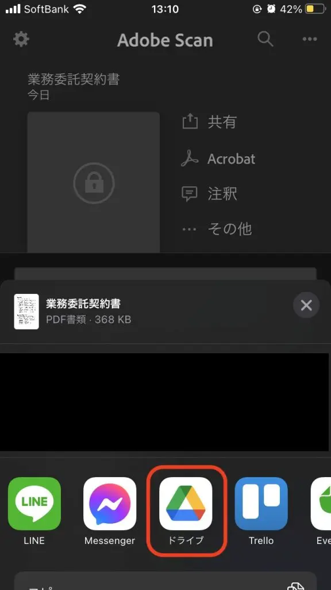

日常的に紙を使うことが多いと、必然的に紙を保管する必要があります。当然、紙を使う業務の量が多ければ多いほど、そして保存期間が長ければ長いほどその量は膨大なものになります。書類を探すときは、管理台帳やバインダーに貼られたインデックス、記憶を頼りにしながら、バインダーやクリアフォルダから探すということも多いと思います。

大手文具メーカーのコクヨが 1031 名のビジネスパーソンを対象に 2017年に行った調査では、1日のうち書類を探している時間は平均20分になることがわかりました。年換算ではおよそ80時間にものぼります。

探す時間以外にも保存するためのクリアフォルダ、バインダーなどの備品、紙を保存するスペース(書棚)と言ったもの必要になってきます。

紙を探したり保存することはペーパーレス化することで大幅に効率化することができます。ペーパーレス化というと専用のソフトウェアや読取りを行う機器などが必要になるイメージがありますが、Google Drive と書類をスキャンするスマホアプリを使って簡単に始める方法をご紹介します。

## 簡単ペーパーレス化の概要
簡単ペーパーレスの流れは、まずはじめに紙の文書を PDF 形式でスキャンできるスマホアプリで撮影します。その後、PDF ファイルとして保存します。次に保存先となる Google Drive に、作成した PDF ファイルをアップロードします。これだけでおおよその作業は完了です。

Google Drive では OCR(光学文字認識)の機能が有効になっており、紙に印刷された文字を自動的に読み取って認識してくれます。ちなみに手書きの文字より活字の方が読み取り精度が高くなります。

アップロードしたファイルを検索する場合は、Google Drive の検索バーからキーワードを入力して検索することができます。OCR で文書内の文字が認識されているので、文書のファイル名だけでなく、文書に記載されている文字列やキーワードでも検索ができます。

## Google Drive の準備
個人用の G Mail を利用していると、一緒に Google Drive も利用できます。ですが、社内で利用している文書を保存するのが好ましくない場合もありますので、企業向けの Google Workspace を利用することをおすすめします。

企業のドメインでメールアドレスを作成できたり、より容量の大きな Google Drive やオンライン会議ツールを利用できます。Google Workspace を導入して上手く使うだけで多くの業務の生産性を上げることができます。

## スマホアプリの準備
文書のスキャンを行うスマホアプリは様々ありますが、ここでは簡単に利用できる Adobe Scan を利用します。お手持ちの iPhone や Android スマホのアプリダウンロードの画面で「Adobe Scan」と検索してインストールしてください。 また、Google Drive のアプリもダウンロードしてログインします。こうすることでファイルの共有メニューを開いたときに、共有先として Google Drive を選択できるようになります。

 

## 文書のスキャンと Google Drive へのアップロード
PDF としてスキャンしたい文書を Adobe Scan で撮影します。Adobe Scan を起動すると、ログインアカウントを選択できます。ここで「Google を使用してログイン」を選択します。

次に文書をスキャンします。Adobe Scan の画面の右下にあるカメラのアイコンをタップして文書を撮影できます。

撮影後に文書の切り取りを行います。青い○や四角をドラッグして文書の境界線を調整できます。調整できたら「続行」をタップします。

「PDFを保存」をタップして切り出された文書を PDF 形式で保存できます。今の段階では Adobe Document Cloud というクラウドストレージが保存先となります。次の手順でこの PDF ファイルのコピーを Google Drive にアップロードします。

続いて、次の画面で Google Drive にアップロードしたいファイル(今回の場合は、業務委託契約書)の「共有」をタップします。

コピーを共有をタップします。

表示された共有先で「ドライブ」をタップします。

ファイルの保存先などを指定して「アップロード」をタップします。

PC から Google Drive を開くと Adobe Scan で撮影した「業務委託契約書.pdf」が保存されていることがわかります。

## 文書の検索
保存した文書を検索するには、Google Drive の検索バーから検索できます。

文書タイトルの「業務委託契約書」でも検索できますが、文書の中に記載されている文言やキーワードでも検索ができます。例えば、業務委託契約書には次の一文が記載されています。

> 5)その他のIT活用プランニングの立案。
> 
この一文をキーワードにして検索すると、業務委託契約書.pdf が検索結果としてヒットします。

OCR の機能で文書内の文字列が認識されるので、検索条件としても利用できますし、文字列のコピーもできます。
また、今回は PDF の文書ファイルでしたが、デジカメやスマホのカメラで撮影した画像ファイル(.jpeg、.png)なども OCR で認識されるので、写真の中に写っている文字でも検索ができます。

## まとめ
ペーパーレス化の手順はいかがでしたでしょうか。
個人用の G Mail であればコストも掛かりません。企業向けの Google Workspace でも、一番安価なプランが月額680円(税別)/1ユーザーで利用できるので、とてもお手軽にペーパーレス化を始めることができると思います。

Google Workspace では Google 検索でも利用されている強力な検索機能を利用できることも大きなメリットです。
この検索機能を有効活用することで、書類を探す時間を大幅にカットできます。また、Google Drive に文書を保存して不要な紙の書類を可能な限り減らすことで、保存スペースの節約なども期待できます。

スマホと Google アカウントがあればすぐに始められるので、業務効率化の第一歩を踏み出されてはいかがでしょうか。
Google Workspace についてはこちらの記事もご覧ください。

[クラウドを活用するメリットとデメリット]()