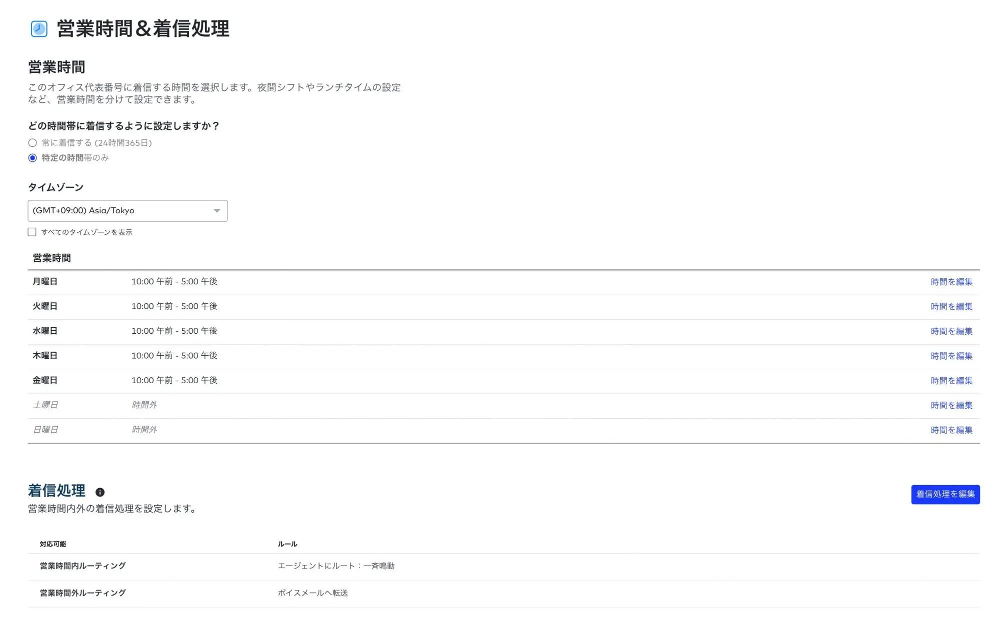

コロナ禍によって、それまで一部の IT 企業でしか行っていなかったテレワークが一気に浸透しました。そうした状況もあって、テレワークと聞くと『家で仕事をする』というイメージが強いと思います。

出社しなくても仕事ができることは非常に大きなメリットですが、テレワークのしやすい業務の仕組みができていることによって、在宅で業務ができること以外にも多くのメリットがあります。
弊社は2021/04/15現在、私一人だけの会社ですが、もともとテレワークをする前提で業務を組み立てていたため、オフィスに出社しなければできない仕事はありません。
今回はどういった業務をどんなツールを活用してこなしているか、弊社の事例を元にご紹介したいと思います。

## 会計
はじめに会計業務ですが、会計ソフトは[freee会計](https://www.freee.co.jp/houjin/)を使っています。

### freee会計 の活用方法
freee会計 は次のように活用しています。

- 銀行口座、クレジットカードの連携
- 見積書、請求書などの発行
- スマホアプリを使った領収書などの登録

銀行口座、クレジットカードと連携させることで、入出金を自動的に仕訳してfreee会計に取り込むことができます。そのため、銀行に出向いて記帳し、金額を会計ソフトに転記するといったことは一切していません。

freee会計から見積書、請求書などを発行すると自動的に売掛金として登録されます。(画像はデモ環境のものです)一番右側の列「登録した方法」が「請求書」となっているものがfreee会計で請求書を発行した取引です。口座に同一金額が入金されると自動的に消込が行われます。

ちょっとした備品を買ったり、会食したりした際の領収書はスマホアプリで撮影してfreee会計に登録しています。領収書を撮影すると、金額や勘定科目が自動的に入力されるので、簡単に登録することができます。

## ファイルの作成と保存
プレゼン資料や各所に提出する申請書、ちょっとしたメモなど業務上作成した様々なファイルはパソコンの中に保存していることは殆どありません。別のパソコンで作業したり、スキマ時間にスマホでちょっと確認したりするときに不便だからです。

### Google ドライブの活用方法
ちょっとしたメモなどは Google Keep に書いたりしていますが、作成したファイルは Google Workspace の Google ドライブに保存することが多いです。Microsoft Office も必要に応じて使っていますが、Excel や Word のファイルもすべて Google ドライブに保存しています。
Google Drive に保存された Excel ファイルなどはダウンロードすることなく参照や編集ができ、変更履歴の管理や保存などが自動で行われます。
パソコンで参照するのはもちろん、スマホでも参照したりちょっとした編集をすることができますし、お客様先などで、その日想定していなかったプレゼン資料をお見せする事もできます。

また、Google ドライブの検索機能は非常に強力なのでファイルを探す時間も大幅に少なく、ファイルの共有も簡単にできるように設計されています。
Google ドライブの活用方法や簡単にペーパーレスを試す方法などは、こちらの記事もご覧ください。

[クラウドストレージの Google ドライブを活用しよう！]()
[GoogleDriveとスマホアプリでお手軽ペーパーレス]()

## 電話

弊社の代表番号は 050-1743-8019 ですが、実は固定電話の番号ではありません。この番号もクラウドのサービス [Dialpad](https://www.dialpad.co.jp/)で取得した番号を使っています。

### Dialpad の活用方法
Dialpad で取得した番号にかかってきた電話は、スマホアプリやパソコンにインストールしたアプリで取ることができます。着信履歴や電話帳が共有されており、営業時間の設定などもできます。

営業時間を設定すると、営業時間内は担当者全員の電話を鳴らす、営業時間外は留守電にする。といった設定が可能になります。

必要に応じて番号も増やすことができるので、新しく支店を作ったり、新しい部署に番号を簡単に割り当てることができます。また、クラウドで提供される050番号なので、引っ越しの際も番号を変えずにすみます。また、多少月額料金が高くなりますが0ABJ番号(市外局番のついた番号)を選ぶこともできます。

 

## まとめ

クラウドの大きなメリットとして、**小さく始めて徐々に拡大できる**、という特徴があります。またお試し期間が設けられている事が多くいので、試しに使ってみて社内のどんな課題が解決できそうか検討してみるのも良いと思います。

会計ソフトを試す、というのは少し難しいかもしれませんが、コミュニケーションを円滑にするためのチャットツールや、ファイルの保存場所としての Google ドライブ、特定のチームや業務で Dialpad を使ってみる、と言ったことはすぐに試すことができると思います。