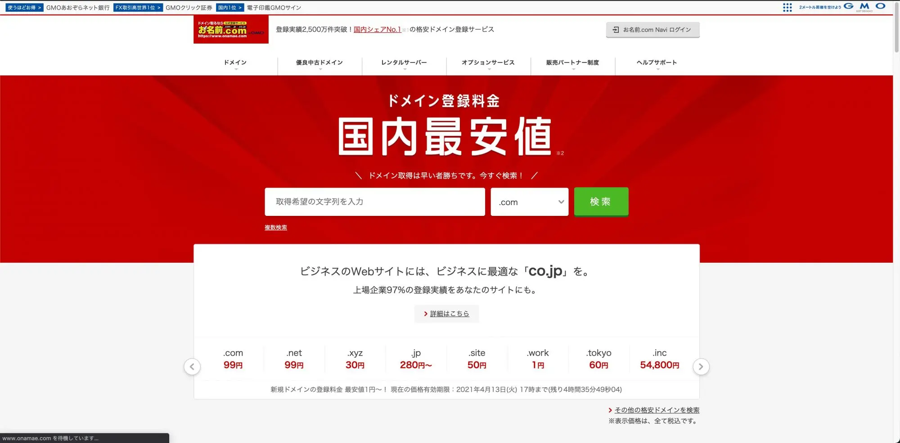
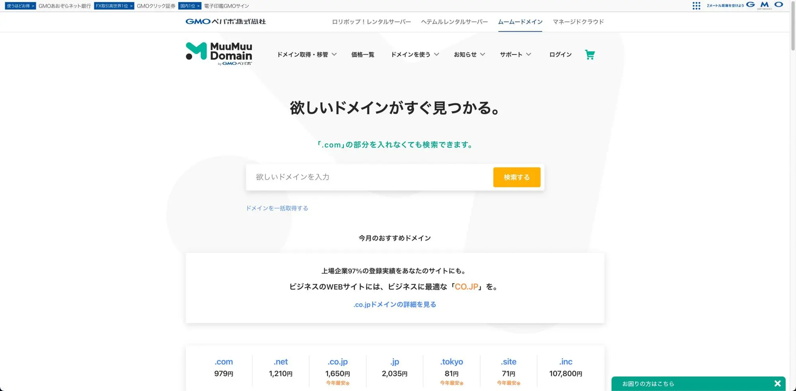
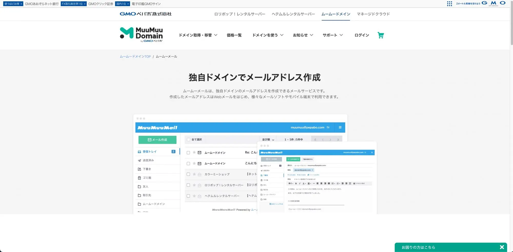
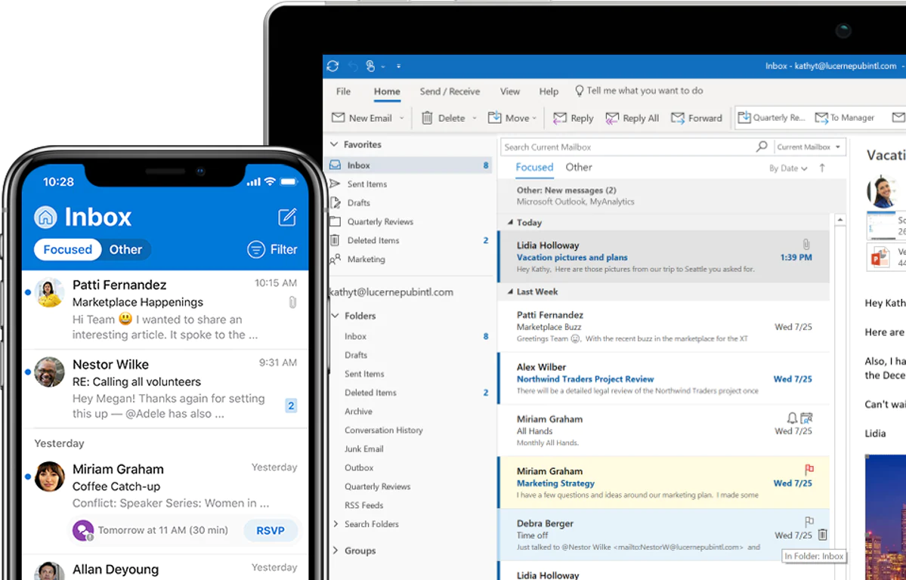

日頃のコミュニケーションで、LINE や Facebook のメッセージ機能でちょっとしたテキストをやり取りする機会は多いと思います。しかし、会社間でのコミュニケーションではまだまだメールが日常的に使われます。得意先との連絡はもちろん、クラウドのサービスを利用するためにメールアドレスを登録することはよくあります。

起業したてのスタートアップや、社員数の少ない小規模企業でも例外ではありません。

しかし、こうしたスタートアップや小規模企業がメールアドレスとしてフリーメール(@gmail.comや、@yahoo.co.jp など)や、携帯のメールアドレス(@docomo.ne.jp など)、プロバイダ契約した際に発行されたメールアドレス(@xxx.so-net.ne.jp、@xxx.ocn.ne.jp など)を利用していることは少なくありません。

特に誰でも取得できるフリーメールは会社としての信用面であったり、安全性、利便性の面で法人利用することはあまりおすすめできません。また、携帯メール、プロバイダから発行されたメールについても、キャリアを解約したら利用できなくなりますし、社員が増えたときの対応が煩雑になったりなど、日々運用していく中で利便性の面でデメリットがあります。

会社独自のメールアドレスを用意することで、こうした課題を解決する事ができます。今回は会社独自のメールアドレスを作る方法と、考慮しておくべきこと、運用のアンチパターン(やるべきではないこと)をご紹介します。

## メールアドレスを作るには？

### 1. ドメインを取得する
例えば、弊社の場合 XXXX@**linkup.works** というメールアドレスを使っています。@(アットマーク)から先の『**linkup.works**』は「ドメイン」と呼ばれるものです。メールアドレスを作るには、まずドメインを取得する必要があります。ドメイン名は全世界で唯一の名前にする必要があり、重複することができません。

ですので、linkup.works というドメイン名を使っている企業は「合同会社 Linkup」以外にはいないのです。それは即ち、ドメイン名は**早いもの勝ち**と言うことです。また、linkup.worksの『.works』という部分はトップレベルドメインと呼ばれ、.com や .co.jp、.biz などのような種類があります。

トップレベルドメインは、世界的なドメインの運営組織によって予め決められたものから選ぶことになります。トップレベルドメインは、その利用用途がある程度想定されています。

| トップレベルドメイン            | 用途                                                                                                               |
| ------------------------------- | ------------------------------------------------------------------------------------------------------------------ |
| .com                            | どのような個人、団体でも利用可能。元々は営利目的の企業向けのドメイン。                                             |
| .org                            | どのような個人、団体でも利用可能。非営利団体での利用が主となっているドメイン。                                     |
| .jp                             | 日本に所在を置く、個人、団体で利用可能なドメイン。                                                                 |
| .biz                            | 企業、ビジネス全般によって利用されることが想定されているドメイン。                                                 |
| .tokyo .osaka .kyoto など | 東京や大阪、京都などに関連のあるもので利用することが想定されているドメイン。比較的新しいドメインなので空きが多い。 |

予めどういった種類のトップレベルドメインがあり、どのようなドメイン名にするか候補を2、3用意しておくことをおすすめします。

ドメインを取得するには、[お名前.com](https://www.onamae.com/?btn_id=onamaetop_header_logo_19th_newdesign)や[ムームードメイン](https://muumuu-domain.com/)と言ったドメイン取得サービスで取得する必要があります。サービスによって取得できるドメインが異なる場合がありますので、欲しいドメインを取得できるか各サービスで検索してみてください。

 

ドメインは取得する名前によって金額が異なります。企業でよく使われる .com や .co.jp などは高額になりますが、.works や .net など .com や .co.jp に比べるとあまり人気がないドメインは比較的安く取得できます。

### 2. ドメインのオプションでメールサービスを利用する
ドメインを取得すると、オプションでホームページを作成したり、メールを利用できるようになります。このオプションで提供されているメールサービスを活用して、自由にメールアドレスを作ることができます。

例えばムームードメインの場合、年間1,320円でメールを利用できるオプションが用意されています。

こうしたオプションでメールサービスを利用する場合は、設定の方法からメールの送信の仕方まで丁寧なマニュアルが用意されていることも多く、設定作業の代行、メールアドレスの一括作成の代行なども行っていることがあります。

## メールアドレスを作る前に考慮しておきたいこと
### 命名規則
メールアドレスを作る上で、初めに考慮しておきたいのが命名規則です。よくあるのは「姓@ドメイン名(yamada@example.com と言ったメールアドレス)」といった命名規則ですが、同姓同名が入社したときや、結婚などで姓が変わったときにどういったルールで運用するかを予め決めておくことをおすすめしています。

よく目にしがちなメールアドレスを命名規則のメリット、デメリットとおすすめ度を一覧にしてみました。それぞれの規則を組み合わせることでも良いと思います。

雇用形態や勤務地など、比較的変更が起こりやすいことをメールアドレスすることはおすすめしません。そのたびにメールアドレスを変更しなければならなくなります。『変更しない』というルールもできると思いますが、重複しやすくなったり、実態とそぐわないメールアドレスになるため、そのルールを採用する意味がなくなります。

また、社員番号やランダムな英数字だけだと利用者や相手が覚えにくいと言ったことがあります。その一方でメールアドレスが推測されにくいため、迷惑メールの対策になるというメリットもあります。

| 命名規則                                         | メールアドレスの例                                           | メリット・デメリット                                                                                                                                                           | おすすめ度 |
| ------------------------------------------------ | ------------------------------------------------------------ | ------------------------------------------------------------------------------------------------------------------------------------------------------------------------------ | ---------- |
| 姓-名2文字@yourcompany.com                       | yamada-ta@yourcompany.com                                    | シンプルなメールアドレスなので、利用者が覚えやすい。メールアドレスが重複しやすいので重複した際のルールを決めておく必要がある。姓が変わったときの対応を考えておく必要がある | ◎          |
| 姓-名2文字-ランダムな英数字3文字@yourcompany.com | yamada-ta-ab1@yourcompany.com                                | シンプルなメールアドレスなので、利用者が覚えやすい。メールアドレスが重複しにくいがゼロではない。姓が変わったときの対応を考えておく必要がある                               | ◎          |
| 氏名@yourcompany.com                             | yamada-taro@yourcompany.com                                  | 利用者が覚えやすいがやや長い。メールアドレスが重複しにくいがゼロではない。姓が変わったときの対応を考えておく必要がある                                                     | ◎          |
| ニックネーム@yourcompany.com                     | yamachan@yourcompany.com                                     | 利用者、相手が覚えやすい。割と重複しやすく、社員が多くなるとニックネームのアイデアが尽きる                                                                                   | △          |
| 社員番号@yourcompany.com                         | a00001@yourcompany.com                                       | 利用者、相手が覚えにくい。姓が変わっても対応が不要。社員番号が重複しない番号ならば、重複する可能性をゼロにできる                                                           | △          |
| 雇用形態-姓@yourcompany.com                      | re-yamada@yourcompany.com (re: regular employee → 正社員) | 利用者が覚えやすい。メールアドレスが重複しにくいがゼロではない。姓が変わったときの対応を考えておく必要がある。雇用形態が変わったときの対応を考えておく必要がある         | ×          |

### 利用するアプリ
もう一つは、どんなアプリケーションでメールを送受信するか。ということです。

一つの方法としては、Windows のインストールされているパソコンであれば、Outlook が予めインストールされているパソコンもあると思います。そうした、元々インストールされているアプリケーションでメールを送受信する方法があります。

[Microsoft 365](https://www.microsoft.com/ja-jp/microsoft-365)や[Google Workspace](https://workspace.google.co.jp/intl/ja/)のような Office ソフトなども含めたコラボレーションサービスを利用する方法です。

Microsoft 365 は Word や Excel、Outlook と言った Office 製品はもちろん、OneDrive(クラウド上の保存領域)や Teams(オンライン会議ツール)などの様々な製品が月額定額で利用できます。Google Workspace も Microsoft 365 と同様に、G mail や Google Drive(クラウド上の保存領域)、meet(オンライン会議ツール)、Office 製品と互換性のあるドキュメント、スプレッドシート、スライドといった製品が月額定額で提供されています。

メールの送受信のためだけに Outlook などのアプリケーションを用意するのではなく、コラボレーションサービスを利用することで社内のあらゆる業務で利用でき、かつ効率的な業務を実現できるので、高い費用対効果が得られます。まだフリーメールや、携帯メールなどを利用されている場合は、コラボレーションツールの導入も含めて、自社独自のメールアドレスを検討されてみてはいかがでしょうか。
