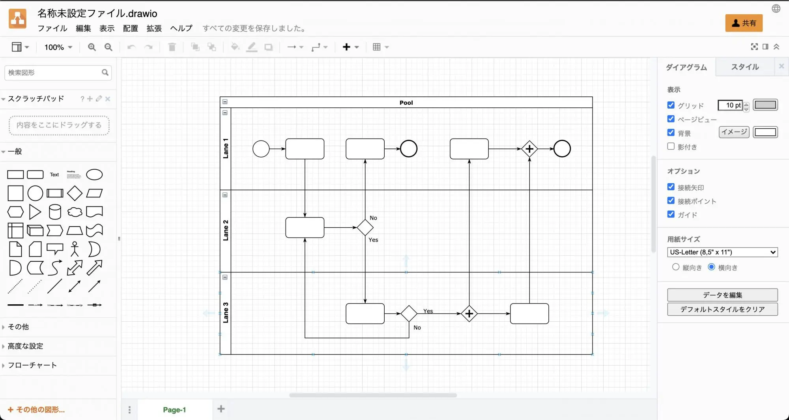

人手不足や、生産性の向上、働き方改革の推進などが叫ばれて久しくなりました。
2020年に入ってからは、これに加えて新型コロナウイルスの流行もあり、密を回避しながらも生産性を低下させないような取り組みが必要不可欠になってきました。

人手不足、密の回避、生産性の低下といった課題を解決するために、日頃の業務を効率化することが、今後一層不可欠になってきます。そこで今回は、次のポイントで業務効率化を成果に結びつける方法をご紹介します。

## 業務の効率化の進め方
業務の効率化をすすめるにあたって一番やってしまいがちなのは、最初に様々なクラウドサービスの資料を取り寄せて比較検討したり、とりあえずお試しで使ってみることです。

しかし、業務の効率化を図るための最初のアプローチとしてはおすすめしません。なぜなら、今の業務の進め方が最も効率の良い進め方とは限らないからです。

また、とりあえずお試しで導入してしまったがために、自社の課題をどのように解決できるかがしっかりと検証できなかったり、あまり使われなかったりしてしまい、期待したほど効果がなかったという誤った判断になりがちだからです。

特に複雑化した業務の流れが存在する場合は、導入したサービスが自社の業務にマッチしない、という誤った判断になりがちです。一番最初に行うこと。それは業務の分解とフローの整理です。

なぜ、今この業務をこの流れで行っているのか、やめることのできる作業はないか、ショートカットできないかなど、ゼロベースで業務を改めて見直す事が必要です。できるだけシンプルにした業務の流れを作った上で、新たに導入するサービスでその流れをより効率よくこなせるようにする事が肝要です。

## 業務フローを整理するには
業務フローを整理すると一言で言っても、何から始めたらよいかわからないことが多いと思います。まず最初に始めるのは、その業務の手順をおこすことです。

何が起点になって始まり、どのような入出力(申請用紙、帳票出力など)があり、最終的にどのような状態になれば完了となるのか。一連の流れを箇条書きなどで整理します。このとき、様々な例外パターンが浮かび上がると思います。

例えば、X月X日にはこのような処理を例外的に行う、株式会社〇〇への発注だけはこの様式で行うなどです。こうした例外も丁寧に拾い上げ、手順におこします。

## 業務フローの整理に役立つツール

業務フローの整理に役立つツールとしては[マジカ](https://www.magicaland.org/%E3%83%9E%E3%82%B8%E3%82%AB%E3%81%A3%E3%81%A6%E4%BD%95/) などがあり、仕事の流れをカードを使って簡単にかつ、わかりやすく整理することができます。特別なツールも不要です。印刷したマジカのカードとペンがあれば始めることができます。

<!-- wp:paragraph -->
また、作図で業務フローを整理したい場合は、[diagrams.net](https://app.diagrams.net/)が非常に便利です。直感的に作図ができ、スイムレーンを使って業務フローの整理ができます。

## 業務の効率化で成果を上げるには
業務の効率化に取り組んでも、成果でているのかどうかは実際に確認しなければわかりません。最も簡単に成果を確認する方法は、その業務にかかっている時間を計測することです。

その業務の開始から完了までの時間を予め計測しておき、効率化の取組後に再度時間を計測してどのように変化したかを分析します。その業務で削減した時間と頻度から、どの程度の改善効果があるかを算出します。例えば、何らかの社内申請業務の改善をした場合の削減効果をシミュレーションしてみます。

**改善前の数字**

|  	 |   |
|---|---|
| 月間申請件数  | 100件  |
| 1件あたりの作業時間(平均)	  | 30分  |
| 作業時間の合計(月)	  | 3,000分(50時間)  |
| 作業時間の合計(年)	  | 36,000分(600時間)  |
| 月間コスト(￥1,500/時間で換算)		  | 75,000円|
| 年間コスト(￥1,500/時間で換算)		  | 900,000円  |

**改善後の数字**

|  	 |   |
|---|---|
| 月間申請件数  | 100件  |
| 1件あたりの作業時間(平均)	  | 3分  |
| 作業時間の合計(月)	  | 300分(5時間) |
| 作業時間の合計(年)	  | 3,600分(60時間)  |
| 月間コスト(￥1,500/時間で換算)		  | 7,500円|
| 年間コスト(￥1,500/時間で換算)		  | 90,000円  |

今後の企業の成長によって、業務量が増えたり社員数が増えたりするば、改善効果はより大きくなります。また、ここでポイントになるのは、年間で90万円かかっていた作業が9万円になることで、81万円分の利益となります。もし利益率が20％の企業の場合、81万円のコスト削減効果は405万円の売上に相当します。

## PDCA を回す
「効率化した仕組みを一度導入して終わり」ではありません。定期的に運用を見直して課題を見つけ、改善を続けることをおすすめします。なぜなら、企業の成長や環境の変化によって、また例外パターンが生まれたり、新たな課題が見つかるからです。

定期的に見直すことで、より効率化を促進するツールの導入を検討したり、関連する業務にまで改善を広げることで相乗効果を得ることができます。

### 効果測定で役に立つツール
成果を確認するための時間測定はストップウォッチなどを使ってもよいのですが、誰かが計測につきっきりになるため、あまり効率がよくありません。そこで時間計測を便利にする[Toggl](https://toggl.com/track/) といったツールを利用すると便利に時間計測でき、複数人で集計することもできます。【参考】[在宅ワークの勘所「時間管理」のためにTogglを活用してみた](https://ascii.jp/elem/000/004/012/4012306/)

## まとめ
業務の効率化と成果を上げるための施策についてはいかがでしたでしょうか。

業務を効率化した効果が出ているかを確認するには、ある程度の時間も必要になってきます。効率化した効果が目に見えてくると、他の業務でも試してみたくなるはずです。ぜひ、日頃の業務に目を向けて、改善してみてはいかがでしょうか。