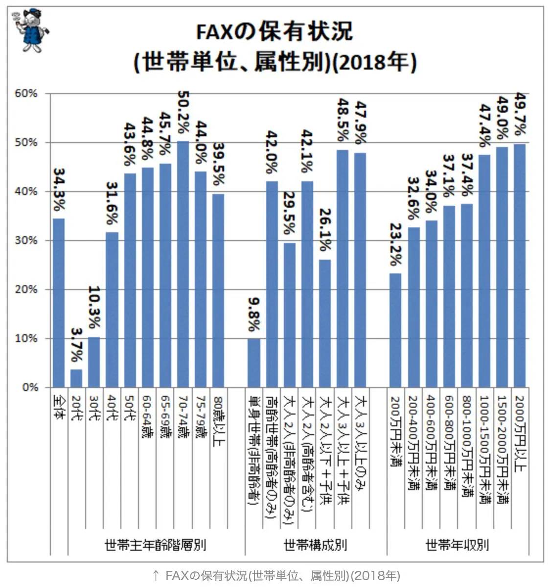

何らかの申込書などを送る際に、メールでは受け付けておらず、FAXまたは郵送で送らなければならないことがあります。

事務所の複合機で FAX を送れたとしても、テレワークをしているがために自宅にFAXがなく送れないといったことや、FAX を送るためにわざわざコンビニに行ったりしなければなりません。
ちなみに、世帯単位での FAX の保有状況を見ると、世帯主が20代、30代の場合、保有率が3.7%〜10.3%となっており、持っている方が珍しい状況です。

[全国では1／3割強…FAXの保有状況をさぐる(2019年公開版)](https://news.yahoo.co.jp/byline/fuwaraizo/20190805-00136966/)

また、スタートアップではそもそも複合機がなかったりすることもあります。弊社も複合機、プリンタは持っていません。印刷が必要な場合は入居している創業支援施設で用意している複合機を使わせてもらっています。

FAX を送らなければならなくなったときに、オンラインで利用できる FAX のサービスがいくつか存在します。今回は FAX.PLUS というサービスを使って無料で FAX を送信してみました。

## FAX.PLUS の料金体系
[FAX.PLUS](https://www.fax.plus/)はインターネット経由で FAX を送受信できるオンラインFAXサービスです。海外製なので、ホームページの日本語が少々機械翻訳チックになっていますが、送信だけを行う場合は無料で利用できるため「急遽 FAX を送りたい」というときには非常に便利です。なお、受信したい場合は有料プランにしなければなりません。

送信は10ページまで無料で利用できます。11ページ以上送信するには1ページ毎に0.20ドルがかかります。日本の番号に送る場合は1ページが2ページとしてカウントされるようですので、実質5ページが無料で送信できます。

## FAX.PLUS に登録する
1. 画面右上の『サインアップ無料(Sign Up For Free)』をクリックします。
   　

2. メールアドレスまたは、Facebook や Google アカウントでサインアップします。
   
   
3. 続いて電話番号での認証を行います。『+81』の後ろに携帯番号を入力し、「Confirm」をクリックします。
   
   
4. 入力した電話番号に SMS が届くので6桁のコードを入力します。
5. ユーザー登録が完了すると、Archive ページが表示されます。
   
   
## FAX を送信する
1. FAX を送信するには「Send FAX」をクリックします。To に送信先の電話番号を入力します。「03-1234-5678」と入力すると「+81 3 1234 5678」という形式に自動的に変換してくれます。
    
2. 「Add File」をクリックして送りたい文面のPDFファイルを添付します。
   

3. 「Send」ボタンの左側にある歯車マークをクリックすると以下のオプションを設定できます。
   
   
   - Scheduled Transmission: 送信日時を指定できます。
   - Retry: 送信に失敗した際に指定した回数再送します。
   - Optimize Document for Fax: FAX 用に文書を最適化します

4. 「Send」をクリックして送信します。
5. 送信された FAX は Archive の Sent に表示されます。
   
   
## Tips
送りたい文書が紙でしかない場合、簡単に PDF にするにはこちらの記事で紹介している Adobe Scan を使うととても便利です。文書をアプリでスキャンし、PDF にすることができます。

<a href="https://www.linkup.works/2020/11/30/easy-way-to-paperless/" target="_blank" rel="noreferrer noopener">Google Drive とスマホアプリで簡単ペーパーレス</a>