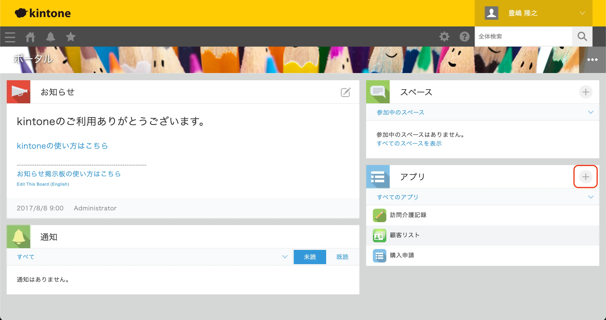

[前回の記事はこちら]()です。

前回は、Excel で管理台帳を作成するときの2つのコツをご紹介しました。

手入力をなくして、関数や Excel の機能を使って、ある程度入力を自動化することと、セルやシートの構成をシンプルに保つことが重要ということをご紹介しました。

このコツを元にして作った台帳を使うことでも、業務の正確性が上がり、効率的にもなっています。今回はこの台帳を元にして、業務をテレワークでも行えるようにしたいと思います。

## テレワークでも利用できるようにするために
台帳を社内にあるパソコンや外付けHDDに保存していては、(基本的には)社外からアクセスできないので、このままの運用ではテレワークには向きません。

手っ取り早くテレワークで台帳を使う場合は、Google Drive や Dropbox といったクラウドストレージ(インターネット上の保存領域)にファイルを保存することです。
Google Drive の機能や特徴については[こちらの記事もご覧ください]()

 

この画像のように、ファイルをクラウドストレージに保存し、共有することで簡単に社外にいてもこの台帳にアクセスすることができます。

しかし、これでは Excel の台帳がただ社外からアクセスできるだけなので、これにプラスしてノーコードツールの kintone(キントーン)を活用して、より効率的なシステムにしてみます。

## kintone を試してみる
[kintone](https://kintone.cybozu.co.jp/) はサイボウズ社が提供しているプログラミングが不要な、業務システム開発プラットフォームです。

1ユーザー月額780円と1500円の2つの料金プランがあり、1500円のプランは30日間のお試し期間が用意されています。
>最低5ユーザーの契約が必要です。

 

外部サービスとの連携、プラグインを使った拡張などができる1500円のプランをおすすめしています。まずは無料のお試し期間に申し込んでみましょう。

## kintone でアプリを作る
### 備品カテゴリマスタと取引先マスタの作成
kintone のアプリを作成するには、ログイン後に表示されるポータル画面の『アプリ』で **＋マーク** をクリックします。その後、『はじめから作成』をクリックします。

 

まずはじめに、備品のカテゴリを管理するためのアプリ『備品カテゴリマスタ』を作成します。

Excel と同様にリストでも良いかも知れませんが、リストにした場合はカテゴリを追加したい時にはアプリを編集しなければなりません。そのため、アプリを編集できない人でも簡単にカテゴリを追加できるようにアプリにしました。



動画でも紹介しているように、左側に表示されている様々なパーツを**ドラッグ＆ドロップ**で右側に配置できます。配置したら『アプリを更新』をクリックします。レコードを追加(Excel での行の追加と同等)をする場合は、右上の **＋マーク** をクリックして追加します。

### 備品管理アプリの作成
続いて備品を管理するアプリを作成します。

備品管理アプリでは備品のシリアルNoや購入金額、購入日を管理し、貸し出し状況や履歴を見れるようにします。貸し出し状況については貸し出し状況を管理するアプリを後ほど作成します。



ここでのポイントは、備品のカテゴリを表示する『ルックアップ』というフィールドです。

ルックアップは別のアプリに登録されているレコードを表示します。ここでは先程作った備品カテゴリマスタに登録されているカテゴリを参照できるようにしました。

動画の中でも操作していますが、レコードを追加する際に『取得』ボタンをクリックすることで、カテゴリマスタに登録されたカテゴリを参照できるようになっています。

必須項目とし、関連付けるアプリとして**備品カテゴリマスタ**を選択し、コピー元のフィールドとして**備品カテゴリ**を選択します。このように設定することで、備品カテゴリマスタに登録されているカテゴリを表示できます。

また、シリアルNoの入力欄は**重複禁止**としました。こうすることで**備品の二重登録を防ぐ**ことができます。

### 貸し出し管理アプリの作成
次に貸し出し履歴を管理するアプリを作成します。

このアプリではどの備品を誰に、いつ貸し出し、いつ返却されたかなどを管理します。



このアプリでもルックアップを使っていますが、応用的な使い方をしています。

備品管理アプリからシリアルNoを取得しますが、『他のフィールドのコピー』の設定で、一緒にその備品の『カテゴリ』も取得して、貸し出しアプリの『カテゴリ』に自動的に入力しています。

また、『コピー元のレコードの選択時に表示するフィールド』の設定では、『取得』ボタンをクリックした際に表示される項目として、シリアルNo以外にもカテゴリや購入日などを表示して、貸し出した備品を取り違えないように工夫しています。

利用者は kintone のユーザーアカウントを持っているユーザーから選択できるようにしました。

### 備品管理アプリの改善
ここまでの作業だけで十分にシステムとして機能しています。

備品を購入したら備品管理アプリに備品を追加します。貸し出した際には貸し出し管理アプリで利用者と、どの備品を貸し出したか、いつ返却されたかなどを登録します。

更に改善するとしたら、備品管理アプリを見た時に、今誰に貸し出しているかを見れると便利です。

そこで備品管理アプリに機能を追加し、貸し出し管理アプリから該当する備品の貸し出し履歴を取得できるようにします。



備品管理アプリに『関連レコード一覧』フィールドを追加します。

参照するアプリで『貸し出し履歴アプリ』を選択し、表示するレコードの条件には『シリアルNo』を選択します。シリアルNoは二重登録ができないようにしているので、該当する備品の履歴だけが表示されます。

貸し出し履歴アプリから、該当するシリアルNoの備品を貸し出した日、利用者、返却の状況、返却日などを取得して表示するように設定します。

備品管理アプリを再度表示すると、その備品の貸し出し履歴が表示されるようになりました。これでその備品の貸し出し状況や過去の履歴が簡単に表示できます。

もちろん、新規に追加した備品には貸し出した履歴はないので、何も表示されません。

## まとめ
今回2回に渡って、Excel 台帳を作るコツと、システム化してテレワークで利用できるようにする方法をご紹介してきました。

kintone はユーザーアカウントを持っていて、インターネットに接続できる環境であればどこからでもアクセスできるので、備品を管理する台帳以外にもアイデア次第でプロジェクトを管理したり、申請業務をしたり、顧客管理をしたりなど、様々な使い方ができます。

また、アプリストアには様々なアプリが登録されており、簡単に環境に追加することができるので、活用してみてください。

