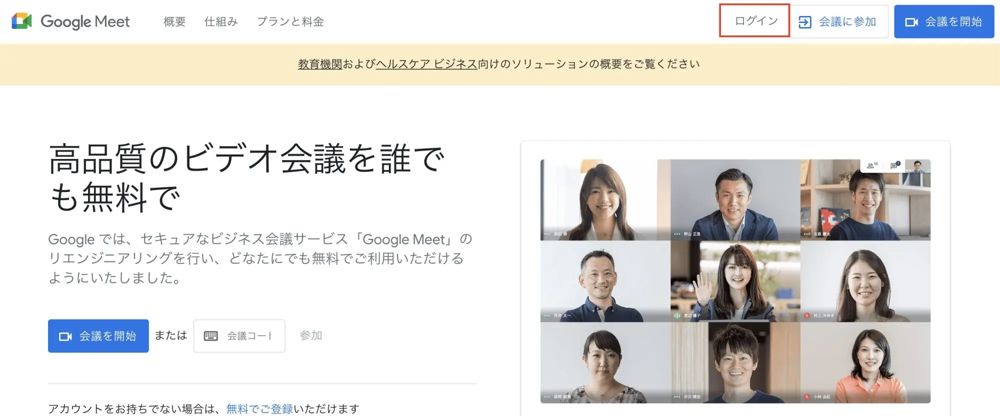
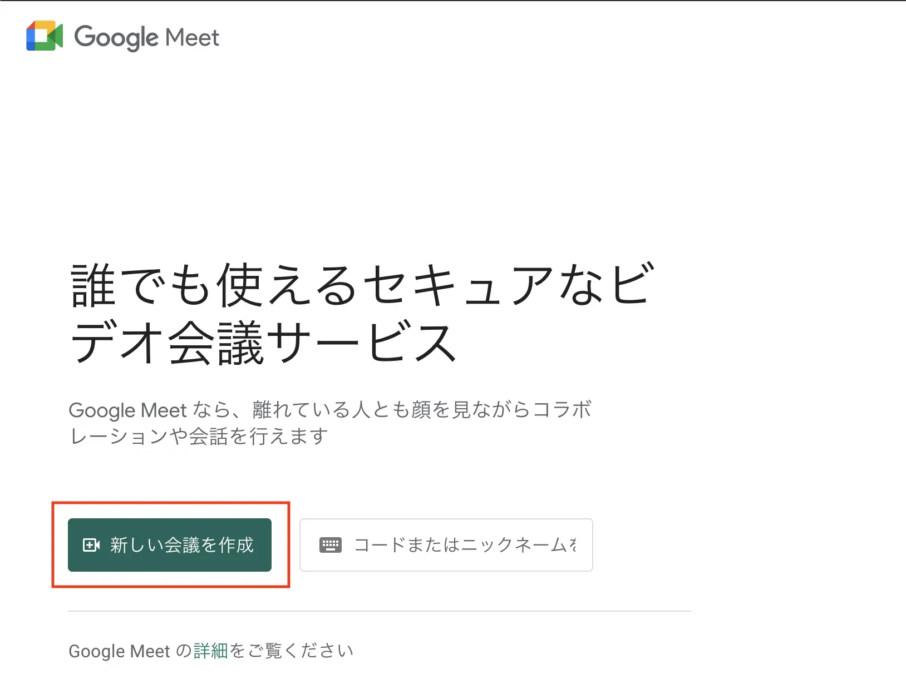
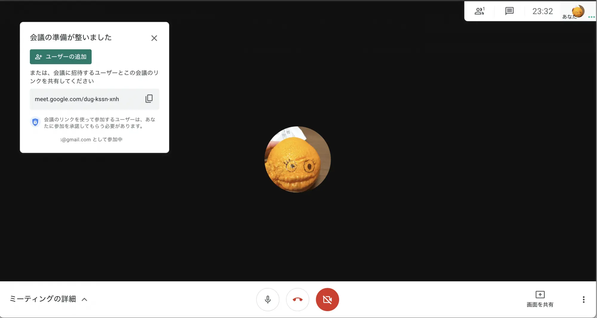
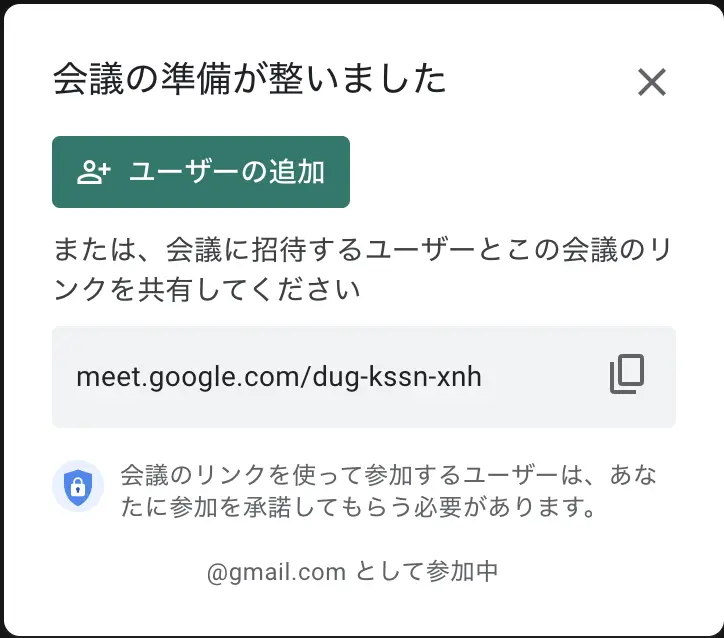
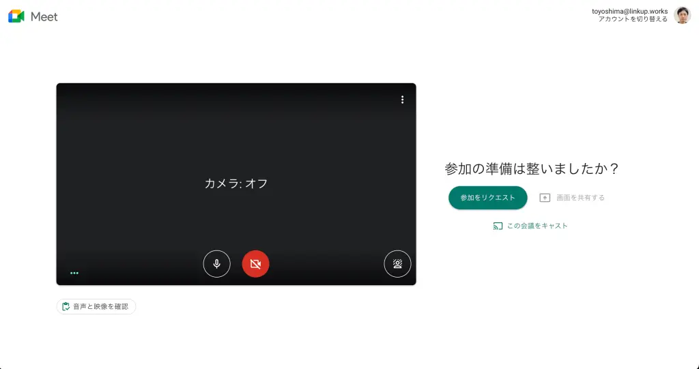
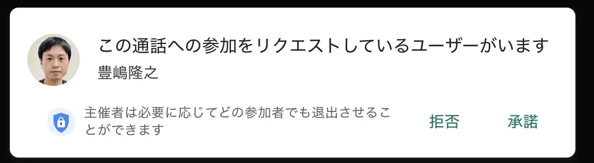
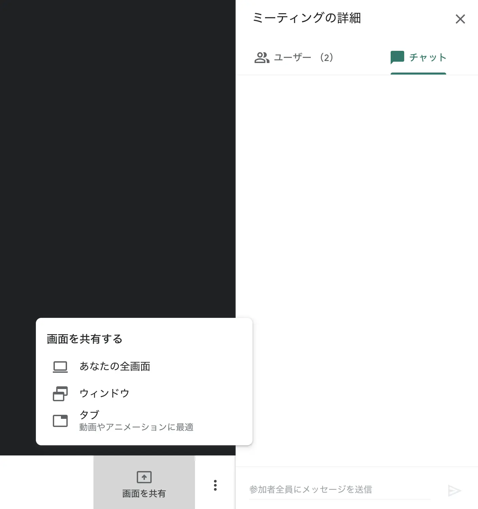
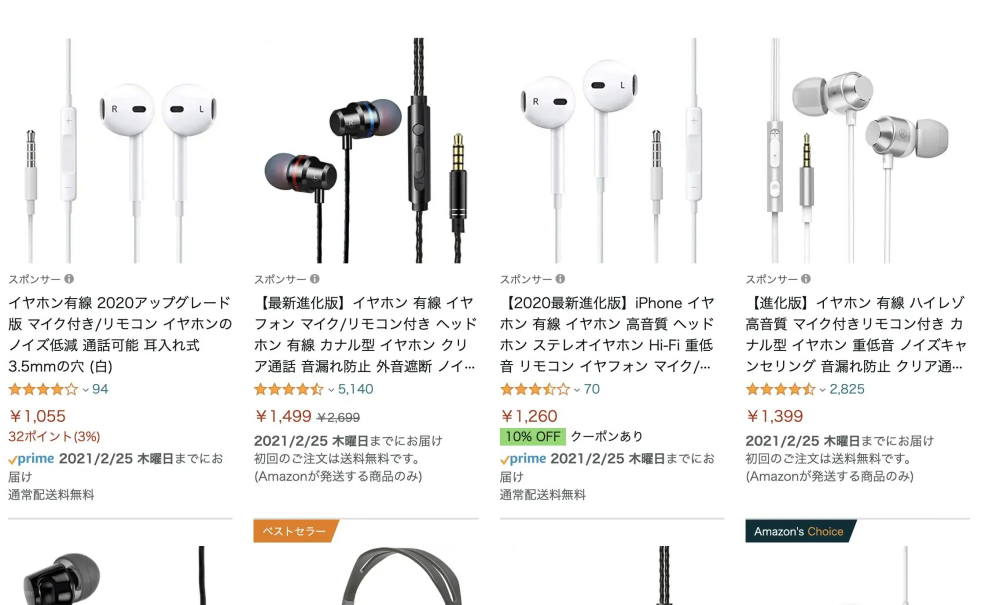

コロナ禍によってオンライン会議ツールを利用したミーティングや商談が一気に浸透し、今ではすっかり珍しいものではなくなりました。オンライン会議ツールと一言で言ってもその数は非常に多く、最も知名度の高い Zoom の他にも、LINE でもオンライン通話ができます。

Linkup ではビジネス向けの Google Workspace で提供されている Google Meet を利用していますが、この Google Meet は無料版の Gmail を利用している方でも利用することができます。一番の特徴としては使い勝手が非常にシンプルなことです。数クリックするだけで会議を開催して、参加者を招待することができます。

今回は無料で提供されている Google Meet でオンライン会議を開催する方法と、オンライン会議をするために必要なものについて紹介します。

## Google Meet での会議の始め方
Google Meet を使用するには Google アカウントが必要です。Gmail を利用している方であれば、メールアドレスでログインします。
[Google Meet](https://apps.google.com/intl/ja/meet/)

Google アカウントを持っていない方は、[こちらから](https://www.google.com/intl/ja/account/about/) Google アカウントの作成を行ってください。

ログインをしたら『新しい会議を作成』をクリックし、『会議を今すぐ開始』するだけです。画面が切り替わり、オンライン会議がスタートします。
 

## 参加者を追加する
参加者を追加するには、『ユーザーの追加』をクリックして、追加したい人のメールアドレスに招待メールを送る方法と、参加のためのリンクを共有する方法の2つがあります。メールアドレスがわからない人であっても、このリンクにアクセスしてもらうことで会議に参加できます。招待された人は『参加をリクエスト』します。リクエストが承諾されるとオンライン会議に参加できます。
 

会議の主催者には次のようなポップアップが表示されるので、『承諾』とすると招待した人が会議に参加できます。

また、オンライン会議の中でチャットや画面の共有などができます。

## その他の必要なもの
Google アカウント以外に必要なものとしてはマイク付きイヤフォンをおすすめします。iPhone に標準で付属しているイヤフォンもマイクが内蔵されていますが、それ以外でも1000円〜2000円前後で購入することができます。
[マイク付きイヤフォン](https://www.amazon.co.jp/%E3%83%9E%E3%82%A4%E3%82%AF%E4%BB%98%E3%81%8D%E3%82%A4%E3%83%A4%E3%83%9B%E3%83%B3/s?k=%E3%83%9E%E3%82%A4%E3%82%AF%E4%BB%98%E3%81%8D%E3%82%A4%E3%83%A4%E3%83%9B%E3%83%B3)

パソコンにもマイク、スピーカーが内蔵されていますが、ハウリングしたり、周囲の環境音を拾ってしまい、声が聞き取りにくいといったことが起こりがちです。そのため、安くても良いのでマイク付きイヤフォンを利用することで音声の品質を向上することができ、より快適なオンライン会議ができるようになります。

## 補足
無料版の Google Meet では、参加者が3人以上の会議の最長時間に制限があり、2021年7月1日現在では最長で1時間までとなるのでご注意ください。

[プランと料金](https://apps.google.com/intl/ja/meet/pricing/)

複数人で1時間以上の会議を開催したり、会議を録画したりする場合には、企業向けの有償版である Google Workspace が必要となります。

## まとめ
Gmail は広く利用されているので、Googleアカウントを持っている方は多いと思います。そのため、Google Meet を使ったオンライン会議も試しやすいと思いますので、ぜひ気軽に試していただきたいと思います。 