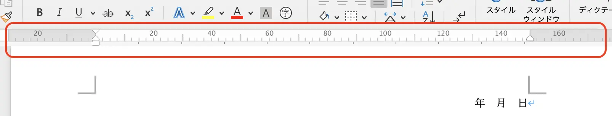

確かな裏付けをとったわけではないのですが、この世で最も使われているアプリケーションは Microsoft の Excel だと思っています。そして、日本人ほど表計算ソフトの Excel で多様な使い方をしている人々はいないと言われています。

その証拠に「Excel 申請書」で検索してみると、膨大な数のテンプレートがヒットします。

ちなみに、海外ではどうかというと、Excel の申請書はあまりメジャーではないようです。下の画像はアメリカのアイオワ州政府のホームページに掲載されている各種申請書の一覧です。 File Format を見るとほぼ全てが編集可能な PDF ファイルか、Word のファイルになっています。

申請書の中身はこんな感じです。PDF ファイルなのですが各項目に入力できるようになっており、Yes/No のチェックも入れられるようになっています。申請書を入力したらメールかFAXまたは郵送で申請するそうです。このへんは日本とあまり変わらないですね。

この記事でお伝えしたいのは、タイトルにもあるように **Excel で申請書を作るのはそろそろやめませんか？** ということです。Excel で申請書を作るも記入するのも結構ストレスが溜まりますし使い勝手もよくありません。Word で申請書を作ることをおすすめしますが、こんなときはどうしたらいいの？というところまで解説したいと思います。

## Excel 申請書のデメリット
### 印刷プレビュー通りに印刷されない

申請書を作成することに限らないのですが、Excel の印刷プレビューで表示されたとおりには印刷されることは少ないように思います。

誰しも一度は経験したことがあると思いますが、改ページプレビューでも印刷プレビューでも枠内にしっかりと文字が収まっているはずなのに、印刷してみると見切れてしまっている。ということはないでしょうか？

[「Excelは印刷するまで信じるな」　新社会人がやりがちな“Excel失敗あるある”に「何度騙されたことか」と反響](https://news.yahoo.co.jp/articles/2f0351a5507ff5e4bd210e26b8375c23fc61ea2a)

申請書に入力して印刷するということを考えると、文字の長さやセルの幅が変更される可能性があるため、きちんと印刷されない可能性が高まります。
実際に印刷してみないと、きちんと枠内に収まっているかどうかわからないので、修正→印刷→確認→更に修正といったように申請書を作成するときも、実際に記入するときも非常に手間がかかります。

### 項目の数を変更しづらい

Excel を方眼紙のように使った申請書で、いわゆる**神Excel**と呼ばれる申請書に起きがちです。緻密に作成された書式で、項目を追加したり、減らしたりすると用紙サイズにきちんと収まるように調整しなければならない場合があります。これを調整するのは時間もかかりますし、上述した印刷プレビュー通りに印刷されない問題と相まって、何度も印刷して見た目を調整しなければなりません。

### 2ページめ以降が見落とされやすい
複数ページに渡って記入が必要な申請書の場合、シート1 に1ページめ、シート2に2ページめというような作りになっていることがあります。こうした作りになっていると、シート1だけ記入し、シート2以降が見落とされやすくなり、記入漏れ、申請不備といったことが起こります。

## 申請書は Word で作ろう
私が強くおすすめするのは、Word を使って申請書を作ることです。Excel がインストールされたパソコンなら Microsoft Office がインストールされていると思いますので、Word も使えるはずです。Word は文書作成ソフトなので、申請書作成にはうってつけです。Excel で起きがちな印刷プレビューと印刷物がずれるということもありませんし、2ページめ以降を見落とすということもありません。

Word で申請書を作成するに際して、こんなときはどうするの？といったご質問について回答したいと思います。

### Excel のように表で集計したい。
使い勝手は Excel ほどよくはありませんが、Word の表でも集計は可能です。こちらのリンクにあるように、表に計算式を埋め込んで集計ができます。

[Microsoft サポート | 表内の列または行の数値を合計する](https://support.microsoft.com/ja-jp/office/%E8%A1%A8%E5%86%85%E3%81%AE%E5%88%97%E3%81%BE%E3%81%9F%E3%81%AF%E8%A1%8C%E3%81%AE%E6%95%B0%E5%80%A4%E3%82%92%E5%90%88%E8%A8%88%E3%81%99%E3%82%8B-110097a9-76c9-449d-a092-82df0ff548d0)

計算式を埋め込みたいセルを選択し、レイアウトタブにある「計算式」をクリックします。

計算式を入力します。画像はみかんの単価と売上個数を掛け算する計算式です。

**注意: 値を更新しても自動で再計算されません**
>Word の表による計算で注意が必要なのは、Excel のように値を変更しても計算式が自動で再計算されないことです。再計算するには画像のように、表の左上の十字矢印をクリックしてセルを全選択し「F9」で再計算します。

 

申請者に表を埋めて申請して貰う場合には不便になりますが、表計算が必要な箇所を別添資料として Excel 形式で用意し、文章での記入が必要な部分を Word にするといったように、適材適所でツールを選択することも重要です。

### 文章の開始位置を微妙な位置にしたい
Word で文章の開始位置を調整する際に、スペースやタブなどを使って調整すると文言を修正したりすると、簡単に体裁がずれるので、ルーラーやインデント、文字揃えを使いましょう。

例えば、こちらの動画では上の段の年月日は**右揃え**で体裁を整えたもので、下の段は**スペース**で体裁を整えました。ちょっと見ただけでは同じような体裁に見えますが、実際に年月日を入力すると、どちらが入力しやすいか、体裁が整っているかは一目瞭然です。



右揃えにすると文字の終端を揃える体裁になりますが、文字の先頭を揃えつつ一番右に寄せたいという場合にはルーラーを使うと簡単に体裁を整えることができます。ルーラーが表示されていない場合は、「表示」タブで「ルーラー」にチェックを入れます。

 

例えば、「所属」と「氏名」を同じ位置から始まるように揃えたい場合に、右揃えにするとそれぞれの文字列の終端が揃ってしまいます。

 

こちらの動画のように、所属と氏名を選択し、文字列の開始位置をルーラーで調整することで体裁を整えることができます。



## まとめ
Excel が悪いと言うことを言いたいわけではありませんし、各種申請業務を行う上ではWordがベストか？というと決してそうではありません。

今では様々な電子申請のツールや入力フォームの作成ツールがあるので、そちらを使うことがベストなこともあります。
あくまで適材適所でツールを見極め、使いこなすこと、そして既存の業務に疑問を持つことが効率化の第一歩だと考えています。