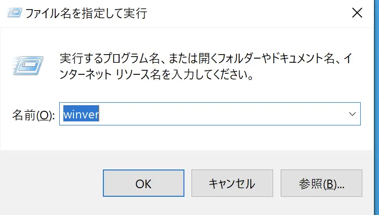
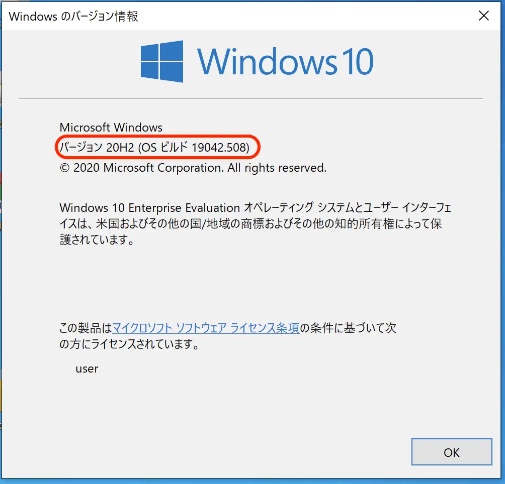

日頃の業務で使っているパソコンには Windows 10 が入っていることが多いと思います。この Windows 10 ですが適切にアップデートはされていますか？

Windows 10 にはサポート期限があり、サポート期限を過ぎた Windows 10 はセキュリティの更新プログラムや追加機能などが配信されず、脆弱性が修正されなかったり、様々なサービスでサポート対象外の OS とされる場合があります。定期的にアップデートしなければ最新バージョンにはならないため、知らない間にサポート期限が切れていた。ということも起こりかねません。

## Windows 10 のサポート期限

サポート期限は[こちら](https://docs.microsoft.com/ja-jp/lifecycle/products/windows-10-home-and-pro)からご確認ください。2021/6/6 現在では以下のバージョンがサポートされています。

| Version      | 開始日     | 終了日     |
| ------------ | ---------- | ---------- |
| Version 20H2 | 2020/10/20 | 2022/05/10 |
| Version 2004 | 2020/05/27 | 2021/12/14 |

リリースされたバージョンは基本的には1年半ほどしかサポートされないのでご注意ください。

## バージョンの確認方法
Windows 10 のバージョンは以下の手順で確認できます。

1. [Windows キー + R]を押し、「ファイル名を指定して実行」で[winver]と入力して[OK]をクリックします。
   

2. [Windows のバージョン情報]が表示されます。[バージョン]に表示されているバージョンを確認します。この画像の場合 **20H2** がバージョンです。上記の表ではサポートの終了日が 2022/05/10 であることがわかります。
   

現在お使いのバージョンをご確認の上、古いバージョンを使っている場合は是非アップデートをしてみてください。
Windows 10 のアップデートを行うにはこちらの記事もご覧ください。

[WindowsUpdateとアップデートしないリスク]()
