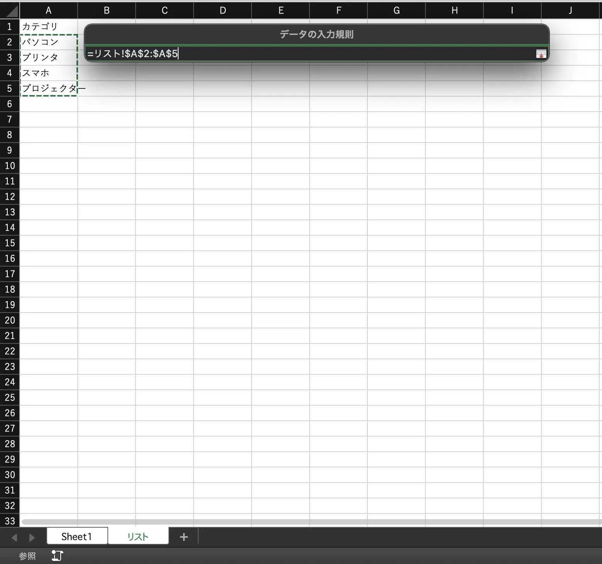
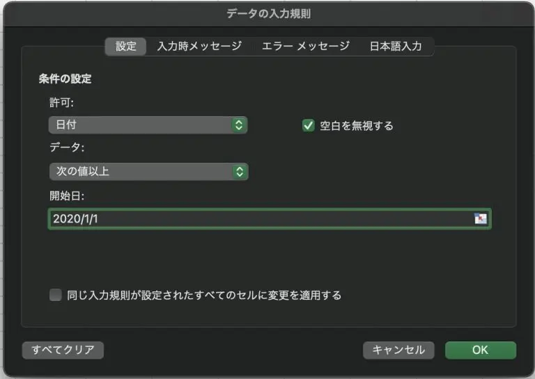
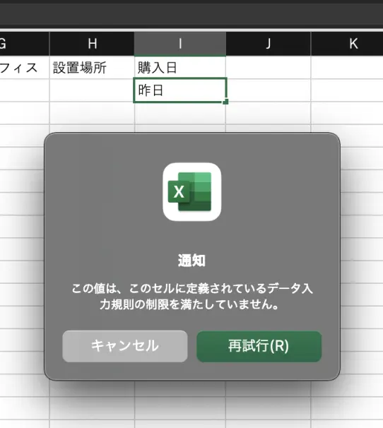
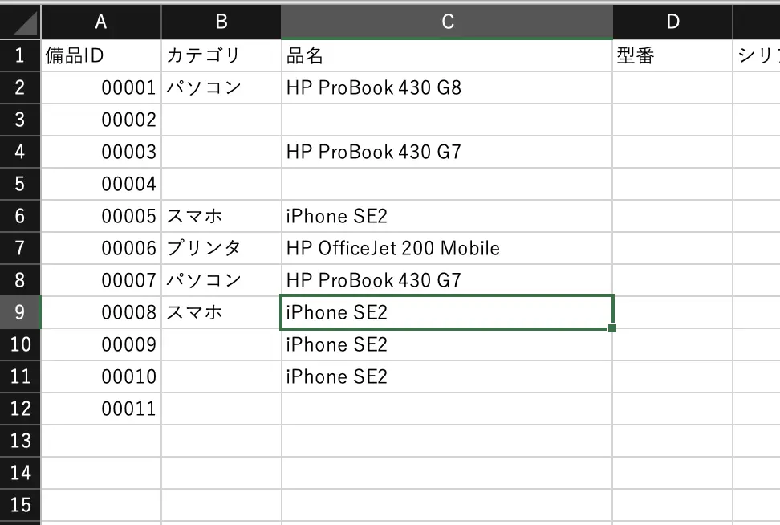
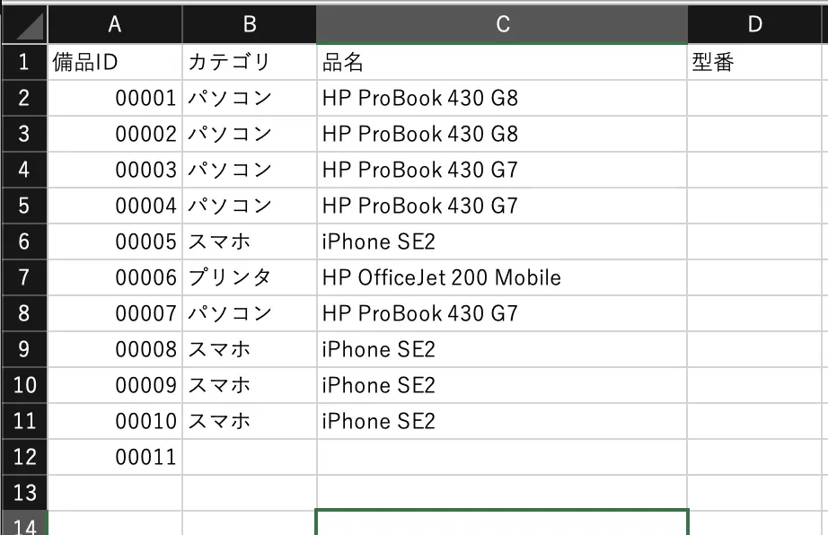
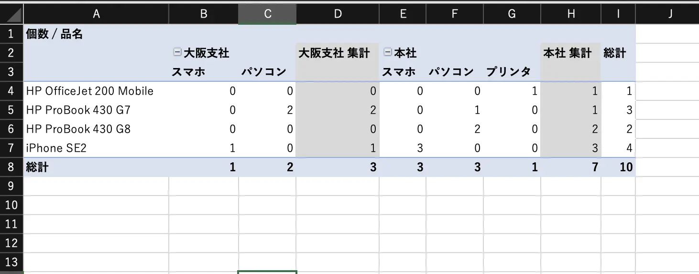

Excel で売上台帳や資産管理台帳などの様々な台帳を作成している企業は多いです。Excel は利用者も多く、実務でも使えるテンプレートや書籍、HowTo の情報なども豊富で、社内の資産や売上などを管理する際に使うソフトウェアとして一番最初に思い浮かびます。

台帳管理する際、管理運用しやすい構造を意識して台帳を作成することは非常に重要です。台帳の作りの良し悪しで業務効率に大きな差が出ます。本記事では管理台帳を作る際に、抑えておきたいポイントについてお伝えします。また、Excel での台帳管理の限界についても触れたいと思います。

## 管理台帳の作成ポイント
ここではよく使われるであろう備品管理台帳を例にして解説したいと思います。どんな備品か、いつ購入したか、どこに設置されているかなどを管理する台帳を想定します。解説するポイントについては備品管理台帳に限った話ではなく、どのような台帳でもポイントになるものです。

### 一意な ID を設ける
その備品を特定できる一意な ID の欄を設けることをおすすめします。ID を読めばその備品が何かがわかるような命名規則にしても良いですし、ただの数字の羅列でも構いませんが、大原則として ID は**重複しないように**設定します。パソコンやスマホなどを管理する台帳であればシリアルナンバーでも良いと思います。
ID を設ける理由としては、管理台帳だけでなく他の台帳でも利用したり、機器に貼り付けるシールなどに ID を記載して、ID を元に情報を辿れるようにします。

### 入力内容がある程度決まっているものは入力規則を使う
例えば、記入した担当者名や、備品の分類でノートPC、スマホ、プリンタ、プロジェクタなどのように、ある程度入力する内容が決まっている項目は入力規則で**リスト**を使いましょう。予め決められた項目から選んで入力させることで、入力間違いを減らすことができます。



動画の中では、選択できる項目を入力規則の中で直接指定していましたが、リストを使う項目が多い場合はリストの項目まとめたシートを作ることもおすすめです。

また、入力規則を設定して、購入日の欄に日付以外を入力できないようにしたり、金額のように集計可能な数値が入るべきところに、全角の数字が入らないようにするなど、**意図しない値が設定されないようにする**ことも重要です。
 

### セル結合しない
セルを結合すると並び替えがうまく機能しなくなったり、フィルタ処理などを行った際に意図しない動作になります。例えばこういったデータです。

こうした台帳だった場合、セルが結合されていることによって備品の台数を確認することが非常に手間になりますし、範囲選択がうまく働きません。下の図のように結合を解除することはできますが、空欄になったセルに正しい情報を入れることも手間になります。

セルの結合はせず、1セルに1データとなるように台帳を作ることをおすすめします。

### 集計、分析は別シートで行う
カテゴリ別の機器台数や、品名ごとの台数、場所ごとの設置機器など、台帳を元に集計したり分析したりする場合は、管理台帳のシートの中で集計はせずに別シートにしましょう。台帳の中に小計の行などが含まれていると、フィルタや並び替えを行うときに意図しない動作になる場合があります。様々な分類で集計するにはピボットテーブルを使うのが便利です。関数を使って集計するよりも手軽に集計できます。

ピボットテーブルの作成方法についてはこちらもご確認ください。

[ピボットテーブルを作成してワークシート データを分析する](https://support.microsoft.com/ja-jp/office/%E3%83%94%E3%83%9C%E3%83%83%E3%83%88%E3%83%86%E3%83%BC%E3%83%96%E3%83%AB%E3%82%92%E4%BD%9C%E6%88%90%E3%81%97%E3%81%A6%E3%83%AF%E3%83%BC%E3%82%AF%E3%82%B7%E3%83%BC%E3%83%88-%E3%83%87%E3%83%BC%E3%82%BF%E3%82%92%E5%88%86%E6%9E%90%E3%81%99%E3%82%8B-a9a84538-bfe9-40a9-a8e9-f99134456576#OfficeVersion=Windows)

## Excel 台帳の限界
Excel 自体は大量のデータを格納することができ、1シートあたり最大行が 1,048,576 行、最大列が 16,384 列となっています。この行列をすべて使うことは非現実的ですが、台帳管理を普通に運用していても『そろそろExcelはきついな』と思うときが必ずやってきます。

具体的な指標は特にないのですが、私の経験から、どのような状態になったときに Excel 台帳の限界と言えるかご紹介したいと思います。Excel 台帳を卒業し、何らかの業務システムにすることを検討するための判断材料にしていただけたらと思います。

### 1. ファイルサイズが1MBを超えるようになった時
データが多くなればなるほどファイルサイズは大きくなります。
通常の Excel ファイルには、Excel 2007 まで使われていた .xls という拡張子と、Excel 2007 以降に標準となった .xlsx の2つがあります。.xlsx の特徴の一つとして .xls のファイルと比較すると、**ファイルサイズが大きくなりにくい**、という特徴があります。
そのため、.xlsx のファイルで1MBを超えるのはファイルとしては比較的大きい部類になります。ファイルサイズが大きくなってくると次のような弊害が出てきます。

1. ファイルを開くのが遅くなる
2. ファイルが破損しやすくなる
3. 集計やフィルタが遅くなる

ファイルが開くのを待つことや、破損したファイルを元の状態に復元することは、なんの生産性にも繋がりません。容量に関わらず、大量のデータを扱っていたり、ファイルが破損することが増えてきたと感じたら、業務システムにすることをおすすめします。

### 2. 入力間違いや入力漏れなどデータとしての誤りが出てきた時
入力間違いや入力漏れなど、データとしての誤りが出てくるというのは台帳管理する上では最も致命的です。

1つでもデータの誤りが見つかると、他にも誤りが含まれる可能性が出てきます。
誤ったデータが紛れ込んでいれば、台帳としての正確性、信頼性が疑わしくなってきます。正しくない情報が含まれる可能性がある台帳を使って運用を行った場合、作業の手戻りや最終的な仕事の成果にも影響が出てきます。

### 3. 他のシステムと連携する必要が出た時
その台帳で管理しているデータを他のシステムにも取り込みたい、という場合があります。例えば店舗ごとの売上管理台帳があったとして、集計した金額を会計ソフトに取り込みたい。といった具合です。

力技になりますが、会計ソフトに取り込むためのCSVファイルにエクスポートするようなマクロを組むこともできますが、マクロのメンテナンスなどでも負担がかかってきますし、ファイルの破損なども引き起こしやすくなります。
kintone などで業務システムを作るといった方法が取れれば、標準機能として CSV 出力ができますし、kintone と API 連携が可能な会計ソフトなどもあります。

## まとめ
Excel は非常に便利ですし、簡単な集計、管理を行うには最適なソフトです。

いい台帳を作るためのちょっとしたコツを掴むことができれば、業務の大幅な効率化が見込めることは間違いありません。
適切に管理できていないがためにかえって手間が増えたり、品質が低下することがあっては本末転倒と言えますので、どこまで Excel で運用していくか、卒業のタイミングを見誤らないようにしたいものです。