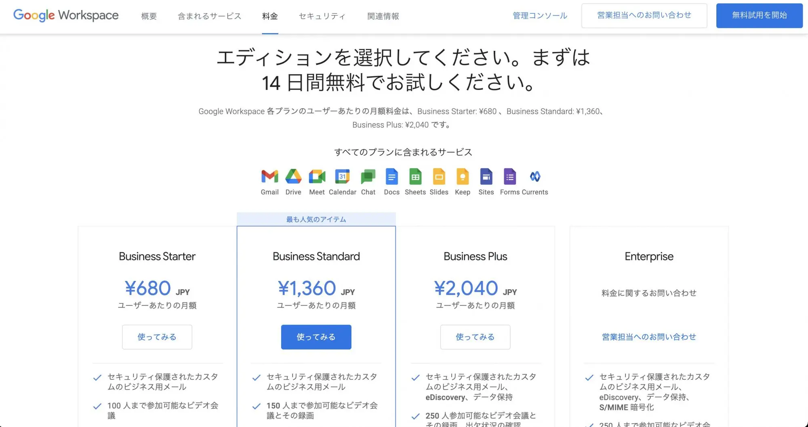
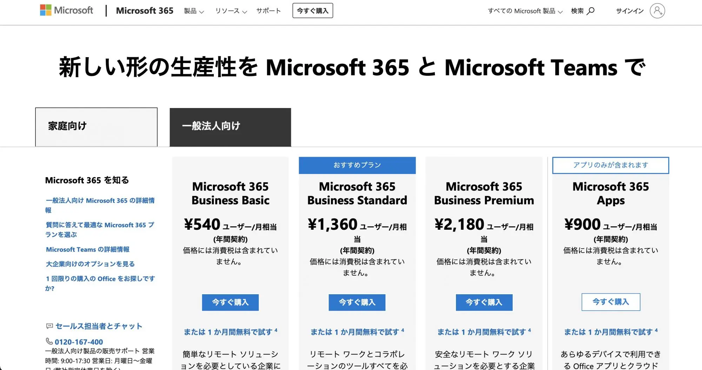
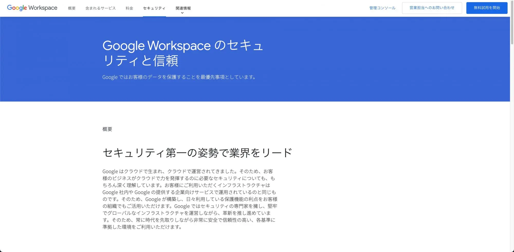
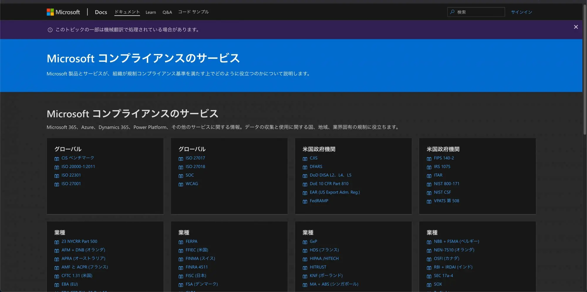

このブログでは度々、『クラウド』というキーワードを何気なく使ってきました。インターネットで IT のサービスを検索しても、クラウドというキーワードはごく自然に使われるようになりました。今回はいつの間にか定着している『クラウド』とはなにか、そしてどんなメリット、デメリットがあるかをご紹介します。

## クラウドとは？
Wikipedia ではクラウドについてこのように解説されています。

>クラウドコンピューティング（英: cloud computing）は、インターネットなどのコンピュータネットワークを経由して、コンピュータ資源をサービスの形で提供する利用形態である[1]。略してクラウドと呼ばれることも多く、cloud とは英語で「雲」を意味する。

もう少し噛み砕いて説明すると、アプリケーションやコンピュータによる演算能力、アプリケーションを動作させるための環境などをインターネットを使って**利用**するというものです。**利用する**という事がポイントで、従来のソフトウェアやサーバーなどのコンピュータなどは購入して**所有**していました。

しかし、クラウドではアプリケーションを月額XXX円で利用したり、サーバーの利用を申し込んで、稼働した時間分を従量課金で支払ったりします。身近な例ではオンライン会議ツールの Zoom や保存領域の Dropbox、ホームページを作成できる Wix、コミュニケーションツールの LINE もクラウドの一つです。

## クラウドのメリット
では、こうしたアプリケーションやサーバーを所有せずに利用するようになったことで、どんなメリットが生まれたのでしょうか。

### 初期費用が安価になった
一番のメリットとしてあげられるのは初期費用が非常に安価になったことです。例えば、Office ソフトや共有の保存領域などを提供しているコラボレーションツールと呼ばれるアプリケーションがあります。Microsoft では Microsoft 365、Google では Google Workspace があり、どちらも1ユーザー数百円からスタートすることができます。また、どちらも無料期間があります。

 

どちらのツールでも、Officeソフト(表計算、文書、スライド)、メール、オンライン会議、共有の保存領域などが提供されています。パソコンだけでなく、スマホやタブレットでも利用できるので、上位のプランではこうしたデバイスの管理を行うことができます。

これまでは、社内でコラボレーションツールを利用する場合、システムを稼働させるためのサーバーやネットワーク機器を購入し、ツールのライセンス、ユーザーのライセンスなどを購入する必要がありました。社員数やシステムの構成にもよりますが、**数千万円〜数億円**ほどがかかる場合がありました。

社員数の少ない企業であれば、高額な初期費用がネックになってコラボレーションツールの導入が進んでいなかったということもありましたが、クラウドで提供されるようになり導入のハードルはかなり下がっていると考えています。

### すぐに使える、すぐに止められる
これまでは様々な機器を用意したり、購入したアプリケーションをインストールしたり、すぐに利用を始めることはできませんでした。そして、そのアプリケーションや機器を購入しているために、止める場合には大きな損失になってしまっていました。クラウドで提供されるツールなどはすぐに使い始めることができます。

上記の Google Workspace や Microsoft 365 はユーザー登録さえすればお試し期間が始まります。従業員が増えたときなどは、すぐにライセンスを追加することができますし、余ったライセンスは削減することができるので、社員数の増減に柔軟に対応することができます。

また、もし止めたくなった場合はすぐに止めることができます。(実際はデータの移行や保存が必要になる場合が殆どなので、止めることが簡単というわけではありません)

### 高度なセキュリティ基準に準拠している
便利で安価に始められるとはいえ、社内のデータをインターネット上に保存するのは不安。という方もいると思います。しかし、Google、Microsoft が準拠しているセキュリティの基準は非情に高度で、データはすべてこうした基準のもとで管理されます。

 

Google、Microsoft 共に取得している認証やセキュリティの規格には次のようなものがあります。

- ISO/IEC 27017
- ISO/IEC 27018
- PCI DSS
- GDPR: 一般データ保護規則

セキュリティや設備に関する投資額は両社とも**年間数千億円規模**とも言われ、莫大な費用をかけて維持しています。

## クラウドのデメリット
### 基本的にセルフサービス
クラウドで提供される様々なサービスは基本的にはセルフサービスで利用します。そのため、利用を開始するにはユーザー自身で申し込むことが基本となります。また、手取り足取りの説明や教育、導入支援などは提供元では行っていないことも多く、わからないことがあった時は、ヘルプページやブログなどを参考に、自分で解決しなければならないこともあります。

しかし、こうしたデメリットも最近では大きなデメリットではなくなってきています。導入支援を行っている企業の存在や、無料のチャットでのサポート、導入支援の相談やパートナーの紹介などのサービスを提供している場合もあり、利用者が感じる不便は小さくなりつつあります。

### 使いこなすにはそれなりにスキルが必要
セルフサービスということもあり、クラウドを活かすも殺すも利用者次第による部分が大きいです。機能のごく一部しか利用していなかったり、利用できる全員が使っていなかったりと言ったことはよくあります。提供されている機能やサービスが多いことも、使いこなすことのハードルの高さにつながっている場合があります。

また、それなりの IT スキルが必要になることも多く、社内で IT に詳しい人に管理業務や利用についての相談が集中したり、頻繁なアップデートにキャッチアップが追いつかない、といったこともあります。

## まとめ
今ではすっかり市民権を得た『クラウド』について、そもそもどういったものなのか、メリットとデメリットを紹介しました。安価で小さく始められるクラウドを活用することは、ヒト・モノ・カネに制限の多い中小企業に大きなメリットがあります。