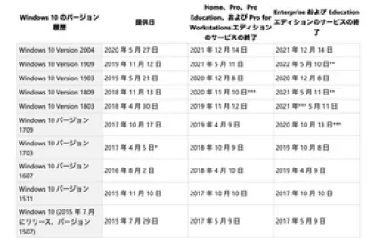

普段から Windows 10 を使っている方は多いと思います。日常的な業務で Excel や Word などのアプリを使ったり、Microsoft Edge や Google Chrome などでインターネットを閲覧している方は多いでしょう。

インターネットの利用は今では当たり前になりましたが、その分様々なセキュリティリスクをはらんでいることも事実です。ウイルス対策ソフトをインストールしていることはセキュリティの基本ですが、Windows 10 や Excel、Word などの Office ソフトのアップデートについてはどうでしょうか。

使っている PC が適切にアップデートされているかどうか、アップデートをする方法、アップデートしなかったらどうなるのかなどについて、今回は書いていきたいと思います。

## Windows 10 のアップデートとは？
Windows 10 が Microsoft 社が開発している OS であることはよく知られています。そして、世に存在する全てのソフトウェアに言えることですが、不具合や脆弱性(ぜいじゃくせい)のないソフトウェアというのは存在しません。不具合がないように見えても表立っていないだけで、不具合は内在しているのです。

不具合や脆弱性が存在するのは、Windows も同様です。Windows 10 は 2015 年にリリースされ、すでに5年以上が経っています。

世界中で数十億人の利用者がいる世界で最も利用者の多いソフトウェアの一つですので、その分不具合や、脆弱性が報告されることも多いソフトウェアです。あらゆるソフトウェアの不具合や脆弱性が登録されている、[脆弱性対策情報データベース](https://jvndb.jvn.jp/)では、2021年7月1日現在で報告されている Windows 10 に関する脆弱性の報告は2425件にもなります。年換算で約485件、月平均で40件前後は報告されている計算になります。

Windows 10 を利用することが危険、ということを言いたいわけではありません。日々、開発元である Microsoft がこうした脆弱性に対応するために、OS の修正を行っており、月に一度インターネット経由で Windows Update として更新プログラムを配信しています。

配信された更新プログラムを PC にインストールし、Windows をアップデートすることで、こうした脆弱性が修正され、Windows 10 をより安全に使うことができます。

## Windows 10 のアップデート方法
Windows を最新の状態にするためのアップデートは数クリックで完了します。

1. Windows ボタンをクリックして[設定]をクリックします。
   
2. [設定]画面で[更新とセキュリティ]をクリックします。
   
3. [Windows Update]画面で[更新プログラムのチェック]をクリックします。　クリックすると、適用できる更新プログラムをダウンロードし、自動的にインストールを行います。
   
4. 必要に応じて再起動します。
   
5. 適用できる全ての更新プログラムを適用すると、[最新の状態です]と表示されます。
   

以上で、Windows のアップデートは完了です。定期的にこの作業を行うことで、Windows を最新の状態にできます。

## Windows 10 をアップデートしなかったらどうなるの？
ここまで、Windows のアップデート、更新プログラムについて述べてきましたが、Windows 10 をアップデートしなかった場合、どうなるのでしょうか？

脆弱性がそのままになることは容易に想像がつくと思いますが、もう一つ大きな問題として、Windows 10 のサポート切れという問題があります。
Windows 10 では、年に2回ほど機能改善や不具合の修正、新たな機能の追加などの大規模な更新が Windows Update で配信されます。

この大型アップデートを適用することで、Windows 10 の内部的なバージョンが更新されます。例えば、2020年5月27日に配信された大型アップデートを適用すると、Windows 10 Version 2004 というバージョンになります。そして、この内部的なバージョン(上記の場合 2004 の部分)には次のようにサポート期限が定められています。

上述した、Windows 10 Version 2004 は2021年12月14日がサポートの終了日となります。

このサポート期限が切れてしまうと、対象のバージョンには新たな更新プログラムが配信されなくなります。それはつまり、**新たな脆弱性が見つかっても修正されない**という事を意味します。そのため、サポート期限の切れたバージョンの Windows 10 を使い続けているとセキュリティリスクが高まり、脆弱性を利用した攻撃の対象になる可能性があります。安全に Windows 10 を使用し続けるには、Windows Update をサポート期間内にしっかり適用し続ける必要があります。

### Windows 10 の内部的なバージョンを確認する方法
今使っている PC の Windows 10 がどのバージョンなのかを確認する方法は、次のとおりです。

1. Windows ボタンをクリックして[設定]をクリックします。
   
2. [設定]画面で[システム]をクリックします。
   
3. 左側のメニューで[バージョン情報](一番下にあります)を選択し、右側の画面で[Windows の仕様]の欄にある[バージョン]から確認できます。
   

図の場合、2004 とあるのでWindows 10 Version 2004 であることが分かります。

Windows は世界中の企業、ユーザーが使っている分、脆弱性も見つかりやすく、その分ウイルスやマルウェア、不正アクセスといった攻撃にさらされやすくなります。安全に使う上でも Windows のアップデートはこまめに実施し、常に最新の状態にしておくことがとても重要です。ぜひこの機会に、Windows 10 のバージョンを確認していただき、最新の状態にしていただけたらと思います。

Windows 10 のサポート期限についてはこちらの記事もご覧ください。

[TWindows 10 のサポート期限をご確認ください]()
